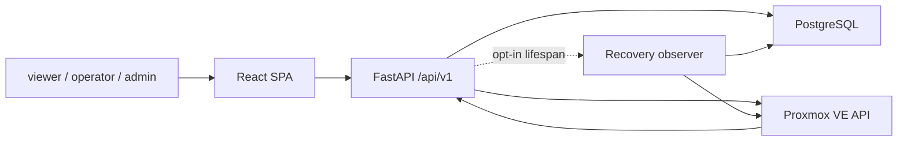

# 현재 아키텍처 기준선

- 상태: `APPROVED`
- 최종 검토일: `2026-09-07`
- 부분 검토: `2026-09-14`, 요청 파일 잠금 제거·보존 정책·고정 IP 이중 확인
- 관련 ADR: 승인된 목표 [`ADR-002`](../decisions/adr-002-modular-monolith-domain-boundaries.md), [`ADR-003`](../decisions/adr-003-production-inventory-connection-truth.md), [`ADR-004`](../decisions/adr-004-postgresql-durable-operation-recovery.md), [`ADR-007`](../decisions/adr-007-observe-first-operations-intelligence.md), [`ADR-008`](../decisions/adr-008-template-based-create-and-persistence-simplification.md); 역사적 결정은 [`ADR index`](../decisions/README.md) 참조

이 문서는 현재 코드의 구조와 남아 있는 전환 경계를 설명한다. 제품 범위는 [Specification](../specifications/project-specification.md), 목표 책임은 [Domain Map](../domains/domain-map.md), 정확한 성공·실패 순서는 [Operation lifecycle](../flows/verified-operation-lifecycle.md), 저장 원자성은 [DB 기준선](../database/current-schema-and-ownership.md)을 따른다. 검토일은 코드와 문서의 대조일이며 live 환경의 배포·검증 완료를 뜻하지 않는다.

템플릿 기반 Create에 집중하고 검토·저장 흐름을 단순화하는 방향은 `ADR-008`에 기록했다. [ADR-012](../decisions/adr-012-create-preset-and-history-retention.md)에 따라 선택적 DB profile과 현재 저장 단위의 입력·검토·승인·작업 기록은 자동 만료·삭제 없이 유지한다. action별 관찰 gate를 유지하며 current-workload writer와 네 action의 파일 잠금은 제거됐다. 향후 설계를 현재 구현으로 설명하지 않는다.

## 1. 시스템 목적과 경계

- 현재 해결 범위: React UI는 인증된 운영자에게 source별 availability·observed time·freshness, exact `/instances/:vmid` 문맥, 대상별 Readiness/Placement finding과 Operations 이력을 연결하는 Workload Cockpit, checksum-linked evidence와 제한적 polling을 제공하는 Operations 상세, Create VM, VM Start, graceful VM Shutdown, 첫 Guided `qm unlock`, observe-only Insights와 jobs/legacy risks를 제공한다. DRS 전용 route, control, backend API/runtime과 persistence model은 없다.
- 제품 경계: Workloads observation과 Insights explanation을 기본 경로로 두고 템플릿 기반 Create VM, VM Start, graceful VM Shutdown과 allowlist 기반 Guided `qm unlock`만 verified action으로 유지한다. 빈 VM·ISO 설치·OS 설치 자동화, DRS policy·approval·execution·reconciliation과 migration은 제공하지 않는다.
- 현재 시스템 책임: local user/session, Gjallar-owned operational records, `/api/v1`, React operator UI, Proxmox API 연동.
- 외부 책임: VM/node/task/config actual state와 실제 hypervisor mutation은 Proxmox가 소유한다.
- 현재 비범위: generic shell/SSH execution, broad lifecycle parity, recovery를 통한 mutation replay·automatic remediation·force unlock, multi-cluster control.
- 목표 비범위: generic TSDB·독립 alerting platform, automatic remediation, arbitrary mutation과 multi-provider 지원.

## 2. 시스템 컨텍스트

- production image는 built React SPA를 FastAPI가 같은 origin에서 제공한다.
- startup은 Alembic upgrade, Create VM profile seed, optional bootstrap admin 후 Uvicorn을 시작한다.
- product runtime의 inventory는 authoritative Proxmox API만 사용한다. 필수 설정 누락은 `unconfigured`, complete snapshot은 `live/fresh`, base snapshot의 sub-source 일부 실패는 `degraded/partial`과 source별 availability, snapshot 부재는 `degraded`로 노출하며 fake fixture로 fallback하지 않는다.

## 3. 현재 아키텍처

- 구조: 단일 FastAPI application과 React SPA를 유지하며 feature-oriented layered monolith에서 domain-oriented modular monolith로 점진 전환 중이다.
- 선택 배경: 기능별 package와 단일 배포를 유지하며 빠르게 운영 기능을 확장해 왔다.
- 현재 장점: deployment가 단순하고 feature code와 contract test가 이미 존재하며 test-only fake adapter injection으로 주요 흐름을 검증할 수 있다.
- 현재 단점: HTTP route는 responsibility module로 분리됐지만 Create VM application facade는 DB, jobs, Proxmox concrete workflow를 직접 알고 있으며 dual record transaction 의미와 전환되지 않은 기능의 책임도 아직 분산돼 있다.
- 재검토 이유: 제품을 Observe-first Operations Intelligence with Verified Actions로 전환하려면 observation·insight·evidence를 기본 경로로 두고 Operations를 제한된 action capability로 유지해야 한다.

## 4. 구성 요소와 책임

| 구성 요소·모듈 | 현재 책임 | 공개 계약 | 현재 소유 데이터 | 주요 의존 대상 |
|---|---|---|---|---|
| `app/main.py`, auth routers | app lifecycle, middleware, login/admin API, SPA fallback | `/health`, `/api/v1/auth/*`, `/api/v1/admin/*` | user/session/account audit | DB, FastAPI |
| `api/v1/router.py` | `/api/v1` viewer dependency와 child router 조립 | `/api/v1/*` | 없음 | child router |
| `api/v1/inventory.py`, `operations.py`, `guided_qm.py`, `insights.py`, `jobs_compat.py`, `vm_actions.py`, `vm_create_compat.py` | inventory·Operation query/GET-only recovery observe·Guided `qm`·Insights·legacy Jobs/Risks·VM action·Create VM HTTP mapping | 기존 `/api/v1` read/action route와 additive recovery observe | 없음 | `inventory_context` provider, Workloads, Operations/Insights/Jobs/VM action facade, Guided use case, Create VM application facade |
| `setup_integration` | redacted Proxmox connection truth와 failure 분류 | `ProxmoxConnectionStatus` | persistent state 없음 | Proxmox adapter |
| `workloads` | authoritative inventory availability application boundary | `WorkloadInventoryQuery` | actual state는 Proxmox 소유 | Setup/Integration, Proxmox adapter |
| `operations/core` | 공통 Operation 상태 전이, digest, projection/event repository 계약과 외부 evidence allowlist | `OperationSpec`, `OperationSnapshot`, `OperationStore`, bounded Proxmox evidence helper | `operations`, `operation_events` | domain과 SQLAlchemy infrastructure adapter |
| `operations/locks`, `operations/recovery` | cluster/VMID durable locator coordination, due item, lease/generation/Operation fence, 네 action handler allowlist, background runner와 operator observe coordinator | durable target lock repository, `RecoveryStorePort`, `OperationRecoveryRunner`, `OperationRecoveryCoordinator` | `operation_locks`, `operation_recovery_items` | PostgreSQL, Operations core, Proxmox GET-only observation |
| `operations/vm_start` | VM Start command·stable intent, application use case, 검증 workflow와 외부 port 계약 | `VmStartCommand`, `VmStartUseCase`, `VmStartExecutionPorts` | 공통 operation/event/recovery와 기존 job/artifact dual record | 추상 Workloads/Mutation/Jobs/Evidence/Lock/Recovery port |
| `operations/vm_shutdown` | graceful VM Shutdown command·stable intent, running pre-check, 검증 workflow와 외부 port 계약 | `VmShutdownCommand`, `VmShutdownUseCase`, `VmShutdownExecutionPorts` | 공통 operation/event/recovery와 기존 job/artifact dual record | 추상 Workloads/Mutation/Jobs/Evidence/Lock/Recovery port |
| `operations/vm_create` | Create VM stable intent, plan·approval·preview·checkpoint/result tracking, GET-only recovery와 idempotent compatibility projection | `VmCreateOperationTracker`, `VmCreateRecoverySession`, `VmCreateRecoveryHandler` | 공통 operation/event/recovery와 기존 request/workload/job/artifact dual record | Operations core/recovery store, Proxmox observation, Create VM compatibility workflow |
| `operations/guided_qm` | 고정 `qm unlock` provisional plan, durable handoff/expiry, attestation, API verification와 GET-only recovery | `GuidedQmUnlockUseCase`, `GuidedQmUnlockRecoveryHandler`, typed command DTO | 공통 operation/event/recovery | Proxmox observation port, shared target lock |
| `proxmox` | read inventory와 mutation client | Python dataclass/client methods | actual state는 Proxmox 소유 | Proxmox VE API |
| `vm_create` | `application.py`의 draft→preflight→plan→approval→preview/execute orchestration과 compatibility 정책·runner | application result/error, workflow functions | profile, request, instance linkage, job/artifact | Operations Create VM tracking, DB, jobs, Proxmox |
| `vm_actions` | VM Start/Shutdown compatibility facade·infrastructure adapter와 post-create readiness | `run_vm_start`, `run_vm_shutdown`, action endpoint | 전용 table 없음; job/artifact compatibility 유지 | Operations VM lifecycle, inventory, jobs, Proxmox |
| `jobs` | job projection과 artifact metadata/content | helper functions, `/jobs`, `/risks` | `job_runs`, `job_artifacts` | DB |
| `insights` | risk/readiness/capacity과 infrastructure-free neutral placement의 availability-aware derived read model | `InsightsQueryService`, `build_placement_model`, `/insights` | persistent data 없음 | Workloads observation, strict job read |
| `frontend/src/app` | auth/session, connection-aware route gate, shell, navigation composition | canonical route와 legacy alias | browser-local transient state | pages, shared |
| `frontend/src/pages`, `features`, `entities`, `shared` | route composition, provenance-aware Workload inventory와 exact VM detail, target 기반 finding·Operation context, Operations evidence/polling·Guided `qm` 흐름, observe-only Insights, Operation·Insight read model, API/auth/connection 공통 계약 | `/instances`, `/instances/:vmid`, `/operations*`, `/insights*`, `/api/v1` consumer | browser-local transient state | backend API; 미전환 page adapter는 기존 components/utils |

## 5. 현재 의존성 규칙

### 실제로 보호되는 관계

- `/api/v1`은 기본적으로 authenticated `viewer`를 요구하고 mutation은 `operator`, account admin은 `admin`을 요구한다.
- `api/v1/router.py`가 공통 prefix/dependency를 가진 composition root이며 query·VM action·Guided `qm`·Create VM child router만 포함한다. inventory query/adapter 선택은 `api/v1/inventory_context.py` provider 경계로 공유한다. additive recovery observe를 포함한 40개 route의 method·path·name·status와 viewer/operator/admin dependency는 `test_api_v1_route_registry.py` characterization contract로 보호한다.
- inventory read adapter와 mutation client는 분리돼 있다.
- product environment mode는 live-only이고 test fixture는 direct injection으로만 연결된다.
- inventory read route는 Workloads query boundary에서 base snapshot이 없는 상태를 `503`으로 차단한다. partial snapshot은 정상 source를 보존하고 endpoint meta의 source별 availability로 불완전성을 공개한다. Create 입력·검토는 partial base snapshot에서도 가능하다. Create 실행은 guest agent 외 source의 complete 관찰을 요구한다. 고정 IP는 입력한 주소의 ping 응답과 기존 VM 설정·guest agent IP 정보를 함께 확인한다. 어느 쪽이든 점유가 발견되면 red로 차단하며, 점유 미발견·조회 불가는 yellow로 직접 확보한 IP인지 확인받는다. 기존 VM의 guest agent 누락만으로 차단하지 않는다. DHCP discovery 경고와 최초 mutation 직전 재검증은 유지한다. Start/Shutdown/Guided의 complete-live 조건은 유지한다.
- VM Start/Shutdown HTTP path는 `api/v1/vm_actions.py`에서 authenticated actor, inventory/client provider와 HTTP error를 mapping한 뒤 compatibility facade를 통해 infrastructure-free command와 application use case로 진입한다. use case가 사용하는 Workloads, mutation, Jobs, Evidence, lock, recovery 의존성은 명시적 port로 전달된다.
- Create VM HTTP path는 `api/v1/vm_create_compat.py`가 operator dependency, inventory provider, success envelope와 `VmCreateApplicationError`→`HTTPException` 변환만 담당한다. `vm_create/application.py`가 기존 draft→preflight→plan→approval→preview/execute 순서, idempotency guard, target lock, Operation evidence와 compatibility DB/job/artifact 기록을 소유한다.
- Guided `qm` HTTP path는 `api/v1/guided_qm.py`가 operator dependency, observation client provider와 `GuidedQmError`→`HTTPException` 변환을 담당하고 `operations/guided_qm` use case를 호출한다.
- VM Start, VM Shutdown, Create VM tracking과 Guided `qm unlock`은 공통 Operation projection과 checksum-linked event repository를 사용한다.
- VM Start, VM Shutdown, Create VM과 Guided `qm unlock`의 같은 `cluster_id`/VMID locator는 PostgreSQL partial unique lock을 공유한다. 파일 잠금은 사용하지 않는다.
- Start/Shutdown은 lock 획득·충돌 직후 Jobs와 Operation을 다시 조회해 같은 요청의 완료 이력을 replay한다. same-owner 경합은 기존 결과 또는 in-progress로 응답하고, foreign lock 충돌의 `blocked` 기록은 current `planned` Operation과 exact open foreign lock을 한 transaction에서 확인한 경우에만 허용한다.
- 네 action은 durable recovery item과 GET-only observation handler를 가진다. `vm_start_observation`, `vm_shutdown_observation`, `vm_create_observation`, `guided_qm_unlock_observation`만 runner가 실행한다. bounded retry를 소진하거나 effect가 불명확하면 `paused`/`needs_reconciliation`과 target lock을 유지하고 mutation은 replay하지 않는다.
- recovery runner는 기본 비활성인 FastAPI lifespan task다. operator/admin의 명시적 recovery observe는 background flag와 독립적으로 같은 handler를 한 번 실행한다. action eligibility, current version/checksum, observe key와 exact lock binding을 확인하며 manual authority가 필요한 상태에서는 자동 관찰을 제공하지 않는다. 세부 상태·멱등성·오류 계약은 [lifecycle](../flows/verified-operation-lifecycle.md)과 [API](../api/current-api-v1.md)에 둔다.
- Guided `qm`은 fixed template과 typed parameter만 받으며 backend shell/SSH executor가 없다. provisional plan과 durable handoff 뒤 authoritative task/config를 다시 확인해야 instruction을 공개한다. operator attestation만으로 성공하지 않으며 expiry·late execution은 별도 verification 의미를 가진다.
- browser가 제출한 actor가 아니라 server-side session actor를 사용한다. operator observe 요청 event만 session actor를 기록하고 자동 observation event는 system recovery actor를 사용한다.
- `operations/core/evidence.py`는 외부 error·connection·task·VM status를 allowlist로 축소한다. raw URL/credential/body/path/poll과 invalid UPID는 evidence나 GET locator로 사용하지 않으며, Guided task/config와 compatibility file metadata도 digest·bounded enum/identity만 보존한다.
- Insights는 `api facade → application → domain/read ports` 방향으로 risk와 inventory source를 독립 수집한다. `insights/placement.py`가 inventory normalization, pressure/candidate/route 계산을 소유하고 별도 identity/policy/lock persistence 또는 DB write에 의존하지 않는다. base source 실패는 section별 `unavailable`로 격리하고 partial snapshot의 exact VM config·guest/detail과 node storage 실패는 `unknown` evidence로 보존한다. 어떤 approval·operation·mutation port도 제공하지 않으며 `drs_advisor`와 `drs-rec-*` 문자열은 공개 compatibility 값으로만 유지한다.
- frontend 전환 영역은 `app → pages/features → entities/shared` 방향을 source contract로 검사한다. app은 legacy component를 직접 import하지 않고, Workload inventory·exact VM detail, Guided `qm`, Insights는 feature public boundary를 사용한다. `proxmox_vm`·`vmid:<VMID>`만 VM route로 변환하며 target filter와 frontend 재검증을 함께 사용한다.
- frontend 하위 메뉴는 Workloads의 Inventory·Create VM, Insights의 Summary·Risks·VM readiness·Capacity·Placement, Operations의 All operations·Job history, Settings의 Account·admin 전용 Users & sessions로 구성한다. 사용할 수 있는 항목이 하나인 하위 메뉴는 표시하지 않는다. Guided `qm unlock`은 별도 하위 메뉴 없이 Operations 목록 상단과 VM 문맥에서 기존 `/operations/guided-qm/vm-unlock`으로 진입한다.
- 독립 Network readiness 화면과 노드 간 bridge/CIDR 비교는 종료됐으며 `/instances/networks`와 `/networks`는 인증된 `/instances`로 redirect한다. `/api/v1/networks`의 network inventory, Create VM network preflight와 Insights VM readiness는 유지한다.
- React SPA에는 DRS navigation, `/drs`·`/instances/drs-policies` route, screen 또는 shared API client method가 없다. 제거된 URL은 일반 unknown-path 규칙을 따른다. Jobs의 historical `drs_migration` renderer는 저장된 evidence 표시를 위해 유지한다.

### 일관되게 보호되지 않는 관계

- Create VM application facade는 아직 DB session, ORM model, job/artifact helper, Proxmox concrete workflow를 직접 알 수 있다.
- 미전환 backend domain과 legacy frontend screen에는 public contract와 private implementation 경계가 일관되게 적용되지 않았다.
- Create VM·Jobs·legacy Risks·Admin frontend 내부는 page adapter 아래 기존 component/utils 구조를 유지한다.

## 6. 현재 책임과 데이터

| 현재 책임 영역 | 핵심 책임 | 소유 상태·데이터 | 다른 영역과의 현재 계약 |
|---|---|---|---|
| Auth | 사용자, role, session, account audit | `users`, `sessions`, `account_audit_events` | FastAPI dependency, authenticated actor |
| Inventory | Proxmox state read/normalization | actual state는 Proxmox; adapter cache는 transient | nodes/VMs/templates/storage/networks model |
| VM Create | profile, request, create workflow | 선택적 `create_vm_profiles`, 이력용 `vm_create_requests` 및 job/artifact | `/vm-create/*`, Proxmox client |
| VM Actions | existing VM action/readiness | 전용 table 없이 `job_runs`, `job_artifacts` | action endpoint, inventory, Proxmox client |
| Operations | operation current projection, append-only event, durable target coordination와 recovery lease | `operations`, `operation_events`, `operation_locks`, `operation_recovery_items` | VM Start/Shutdown, Create VM, Guided `qm`, additive operation API |
| Jobs/Risks | 최신 job projection, artifact, derived risk | `job_runs`, `job_artifacts` | `/jobs`, `/risks`, producer helper |
| Insights | source별 derived finding, availability와 neutral placement | persistent state 없음; request-time projection | `/insights`, Workloads observation, Jobs risk |

물리적인 ORM model은 대부분 `backend/app/db/models.py`에 함께 있다. Operations core의 두 model은 `backend/app/operations/core/infrastructure/models.py`로 분리됐지만 Create VM 등 나머지 repository ownership은 아직 분리되지 않았다. 목표 logical ownership은 [`domains/domain-map.md`](../domains/domain-map.md)에 제안한다.

## 7. 트랜잭션과 정합성

- `session_scope()`는 helper/service의 DB transaction 경계다. Operations projection 변경과 대응 event append는 한 transaction이며 외부 Proxmox 호출은 참여하지 않는다.
- recovery commit은 유효 lease를 확인하고 Operation row 및 exact locator lock을 잠근 뒤 event/projection, recovery 상태와 optional lock release를 함께 기록한다. expected version/checksum을 넘긴 호출은 그 값도 검증한다. recovery의 local projector는 이 검사 이후 같은 DB session을 사용한다.
- action마다 완료 순서가 다르다. Create 성공은 request/job/artifact와 Operation 결과 projection과 최종 `succeeded`, recovery completion, lock release를 한 transaction에서 닫는다. Start/Shutdown은 terminal Operation을 먼저 기록하고 foreground Jobs 저장을 별도로 수행한다. restart recovery에서는 Jobs projection과 completion event/recovery/lock release를 함께 닫지만 앞서 기록한 terminal Operation 전이까지 한 transaction인 것은 아니다.
- 따라서 `succeeded`인 Start/Shutdown도 recovery 미완결과 owned lock을 가질 수 있다. UI가 terminal status와 별도로 recovery와 lock을 확인하는 이유다. compatibility 기록이나 DB coordination 완료 실패는 action-specific `503`과 exact Operation handoff로 드러낸다.
네 action의 파일 잠금 생성·cleanup·port는 제거됐다. PostgreSQL locator lock의 owner·lock ID와 recovery lease fence로 조정하며, terminal projection·recovery completion·잠금 해제는 DB transaction으로 처리한다. lease 만료만으로 잠금을 해제하지 않는다.

## 8. 외부 시스템

| 시스템 | 목적 | 호출 방향 | 현재 실패 격리 | 계약 위치 |
|---|---|---|---|---|
| Proxmox VE API | inventory, VM create/start/graceful shutdown, task/post-check | Gjallar → Proxmox | adapter/client 분리, timeout, workflow별 gate와 task evidence | `backend/app/proxmox/` |
| PostgreSQL | Gjallar-owned users와 operational state | Gjallar → PostgreSQL | `session_scope`, Alembic, test-only SQLite guard | `backend/app/db/`, `backend/alembic/` |
| Browser | operator UI와 session cookie | Browser ↔ Gjallar | HttpOnly cookie, origin validation, RBAC | `frontend/src/`, auth/API routers |

외부 queue·scheduler·cache 서비스는 사용하지 않는다. inventory adapter에는 기본 10초의 process-local snapshot/detail cache가 있다. recovery observer는 같은 FastAPI image의 기본 비활성 lifespan task이며 operator-triggered observe는 request threadpool에서 같은 coordinator/handler를 한 번 실행한다.

## 9. 현재 주요 실행 흐름

| 흐름 | 현재 동작 | 실패·종료 경계 |
|---|---|---|
| Workloads → Insights → Operations | exact VM observation, 같은 target의 finding, 허용된 action과 작업 evidence를 연결 | partial/unavailable을 0건·정상으로 숨기지 않음 |
| Create VM | 템플릿 직접 입력·선택적 DB 프리셋으로 검토 → plan·승인·preview → lock/recovery → 템플릿 clone·설정·선택적 부팅 → 검증 | ambiguous mutation은 재실행하지 않고 checkpoint를 GET으로 재관찰 |
| VM Start | stopped non-template pre-check → start task → running 직접 확인 | UPID/task/status 불일치 시 reconciliation |
| VM Shutdown | running non-template pre-check → graceful shutdown task → stopped 직접 확인 | hard stop/reboot fallback 없음 |
| Guided `qm unlock` | eligibility → provisional plan/lock/handoff → 외부 수동 실행 → attestation → API 검증 | instruction 만료·late attestation만으로 성공 또는 lock 해제하지 않음 |
| Recovery observe | exact item claim → allowlisted GET-only handler 1회 → evidence·projection 갱신 | busy/stale/binding 불일치와 retry exhaustion을 명시 |

상세 action 단계와 crash window는 [Operation lifecycle](../flows/verified-operation-lifecycle.md), endpoint는 [API 기준선](../api/current-api-v1.md), 실제 대응 절차는 [운영 runbook](../operations/runbook.md)의 책임이다.

## 10. 런타임과 배포 제약

- 실행 단위: React build와 FastAPI를 포함한 single Docker image.
- 환경 경계: local dev는 Vite `5173`과 FastAPI `8000`; production은 same-origin SPA/API.
- 성능·확장: 정량 SLA와 horizontal scale contract가 없다. PostgreSQL lock/lease는 multi-replica claim을 조정하지만 recovery는 API process와 resource를 공유하고 concurrency 1로 제한된다.
- 시크릿·네트워크: PostgreSQL과 Proxmox credential은 environment/orchestrator secret으로 주입한다.

## 11. 테스트 경계

- 단위: preflight, view model, normalization 등 순수·준순수 로직.
- 통합·계약: FastAPI `/api/v1`, auth/RBAC, SQLAlchemy/Alembic, jobs/artifacts, static SPA, frontend client/route.
- 외부 대역: test에서 직접 주입한 fake inventory/mutation client와 test-only SQLite를 기본 사용한다. product runtime environment에는 fake inventory mode가 없다.
- contract test의 주요 대상은 neutral Placement, route registry, 네 action의 lock/recovery, operator observe fence와 migration hard-zero guard다. 실행 명령과 조건은 [프로젝트 프로필](../project-profile.md)의 단일 기준을 따르고, 실행 결과는 해당 Plan·CI·evidence에서 확인한다. 코드 검토를 실제 live mutation 검증으로 표현하지 않는다.

## 12. 알려진 위험과 기술 부채

- 조회·VM action·Guided `qm`·Create VM route는 `api/v1/{inventory,operations,guided_qm,insights,jobs_compat,vm_actions,vm_create_compat}.py`로 분리했다. Create VM application facade의 concrete workflow 의존과 미전환 큰 screen/view-model의 책임 집중은 계속된다.
- VM Start/Shutdown과 Create VM lifecycle은 Operations에 연결됐지만 기존 `job_runs`/`job_artifacts`와 Create VM 입력·작업 이력용 request가 있다. `job_runs`는 VM Start/Shutdown의 멱등 replay와 recovery terminal projection에도 사용되고 common Operation detail은 artifact content 저장·metadata 조회를 아직 대체하지 않는다. 저장된 historical `drs_migration` job/artifact도 generic history 조회와 renderer를 통해 계속 읽을 수 있다.
- public `/jobs`·job detail·artifacts와 `/risks`는 strict persistence read를 사용해 DB 장애를 각각 stable `503`으로 반환한다. 내부 compatibility helper의 fail-open 함수는 남아 있으나 이 public read route에서는 사용하지 않는다. `/insights`는 strict read 실패를 risk source `unavailable`로 격리한다.
- `job_runs`는 최신 projection, `job_artifacts`는 upsert 성격이라 immutable operation audit가 아니다.
- 네 action에 action-specific GET-only restart handler와 fenced operator observe API가 있다. 다만 generic force-complete, arbitrary lock release, mutation retry, reverse compensation API는 없으며 ambiguous Create mutation phase와 충분한 evidence가 없는 manual effect는 운영자 판단 영역이다.
- 네 action의 파일 잠금 생성·cleanup·port는 제거됐다. PostgreSQL locator lock의 owner·lock ID와 recovery lease fence로 조정하며, terminal projection·recovery completion·잠금 해제는 DB transaction으로 처리한다. lease 만료만으로 잠금을 해제하지 않는다.
- Guided instruction이 발급된 뒤 외부 Proxmox 도구가 별도 작업을 시작하는 경쟁은 local lock으로 차단할 수 없다. active-task double read, 짧은 expiry, stale instruction 실행 금지와 API after-state verification으로 성공 오판을 방지하지만 live cluster 검증은 수행하지 않았다.
- target identity는 configured `GJALLAR_CLUSTER_ID`와 VMID를 사용한다. multi-cluster connection profile과 cluster별 worker partition은 아직 없다.
- stale snapshot persistence가 없어 base snapshot을 얻지 못한 `degraded` 상태에서는 이전 inventory를 read-only로 열람할 수 없다. 현재 partial snapshot은 stale fallback이 아니며 정상 source만 표시한다.
- `live` connection은 inventory read 성공을 뜻할 뿐 token의 mutation permission discovery는 아직 제공하지 않는다. mutation은 기존 RBAC·approval·Proxmox response gate를 계속 사용한다.
- backend dependency lock은 마련됐지만 formatter/lint/type-check 기준은 아직 없다.

## 13. 합의한 Create 수정 방향과 현재 차이

| 항목 | 현재 구현 | 합의한 다음 방향 |
|---|---|---|
| 생성 방식 | Proxmox 템플릿 clone | 템플릿 기반에 집중; 템플릿 제작·OS 설치는 Proxmox에서 수행 |
| 입력·검토 | 템플릿 직접 입력·선택적 DB 프리셋, 계산·저장 함수 분리 구현. draft/preflight는 Jobs 기록 | ADR-012에 따라 기존 DB 프리셋과 현재 저장 단위의 자동 삭제 없는 보존 유지; 장기 이관은 별도 설계 |
| 계획·기록 | 반복 plan artifact 저장, manifest/planned Git diff, 입력·작업 이력용 request/Jobs와 Operation 결과 | 승인·실행 consumer가 사용하는 증거 보존; current-workload write 제거 |
| 실행 안전성 | exact approval, idempotency, durable lock/lease/checkpoint, action별 관찰 gate | 안전성 기록을 유지하며 구체적 제거·이전·gate 변경은 별도 설계·검증 |

이 방향은 [ADR-008](../decisions/adr-008-template-based-create-and-persistence-simplification.md)의 설계 기준과 [ADR-012](../decisions/adr-012-create-preset-and-history-retention.md)의 저장 정책을 따른다. DB profile의 optional preset 전환은 구현됐다. table 삭제·migration 또는 partial 상태에서의 실행 허용은 이 프리셋 전환에 포함되지 않는다.

### Create 검토 계산과 저장 경계

Create의 `drafts.build_default_vm_draft`와 `preflight.run_preflight`는 application에서 조회한 프로필 정책을 명시적으로 받는다. `planner.calculate_vm_create_plan`은 DB 접근 없이 plan core·manifest·planned diff를 계산한다. `plan_persistence.persist_vm_create_plan`이 기존 다섯 artifact를 저장하고 승인 metadata를 포함한 응답을 조합한다.

계산·저장 경계 분리 이후 template 직접 입력을 추가했다. 이 경로는 DB 프로필을 읽지 않으며 빈 profile ID를 기록한다. 기존 profile 요청은 DB 프리셋의 기본값·제한을 유지한다. draft/preflight Jobs, artifact ID·checksum·기록 시점과 승인·복구 계약은 유지한다.

### Create 최초 mutation 전 관찰

`WorkloadInventoryQuery.require_fresh_mutation_adapter`는 별도 Live adapter의 cache 없는 snapshot을 수집하고 `ObservedInventoryAdapter`에 고정한다. 일반 read cache를 초기화하거나 공유하지 않는다. Create application은 durable dispatch 준비 후 승인 VMID의 preflight와 plan core를 계산해 기존 승인과 비교하며 이 과정에서 plan artifact를 다시 저장하지 않는다. 재검증 앞뒤 lease heartbeat를 수행하고 실패 시 최초 mutation 없이 기존 pre-dispatch 정리 경로를 따른다.

Create source별 gate와 직전 Proxmox 관찰은 유지한다. 완료된 과거 요청은 VMID 재사용을 막지 않으며 진행 중·미확정 Operation과 durable lock은 차단한다. unresolved legacy 요청도 계속 차단한다. 직전 GET 이후 외부 경쟁은 API 실패·task·post-check로 처리한다.

### 템플릿 직접 입력

UI의 기본 입력은 template이며 프리셋은 선택 사항이다. `creation_mode=template`은 명시한 template node/VMID를 조회해 기본 사양을 얻고, 프로필 조회 없이 draft·preflight·plan·승인·fresh 검증을 수행한다. 양의 정수 사양, 대상 노드 CPU·총 메모리 용량과 기존 storage·network·access 검증을 적용한다. Ubuntu family 고정은 직접 입력에 적용하지 않는다. 프리셋을 선택하거나 mode를 생략한 기존 API 요청은 기존 DB profile 경로를 사용한다.

UI의 로컬 복제 프로필과 고정 노드·접속 사용자 기본값을 제거했다. 프리셋 API 실패는 직접 입력을 막지 않으며 선택된 프리셋이 사라지면 해당 경로는 차단한다. 직접 입력에서 `profile_id`가 빈 값이어도 Operation을 생성할 수 있지만, 승인 대상·artifact/digest·VMID 필수 조건은 유지한다.

### Create partial 관찰 경계

Create 입력·검토는 partial base snapshot에서도 가능하다. Create 실행은 guest agent 외 source의 complete 관찰을 요구한다. 고정 IP는 입력한 주소의 ping 응답과 기존 VM 설정·guest agent IP 정보를 함께 확인한다. 어느 쪽이든 점유가 발견되면 red로 차단하며, 점유 미발견·조회 불가는 yellow로 직접 확보한 IP인지 확인받는다. 기존 VM의 guest agent 누락만으로 차단하지 않는다. DHCP discovery 경고와 최초 mutation 직전 재검증은 유지한다. Start/Shutdown/Guided의 complete-live 조건은 유지한다. `require_create_adapter`는 initial/fresh 관찰에 같은 source 조건을 적용한다. 최초 gate는 원래 adapter를 유지하고 fresh 검증 결과만 고정한다. preflight는 실패 source와 대상 목록을 기록한다. 내부 connection state/freshness는 partial을 유지하며 상단은 연결됨과 관찰 일부 누락을 나누어 표시한다. 관찰된 IP에 충돌이 없다는 사실은 외부 네트워크 전체에서 미사용임을 보증하지 않는다.

### 생성 이력 조회 경계

Create completed replay는 succeeded Operation에 저장된 workload snapshot을 읽으며 operation type/mode/target·node·VMID와 결과 필드를 검증한다. 현재 linkage에 의존하지 않는다. 성공 결과가 손상됐으면 현재 row로 대체하지 않고 reconciliation-required로 닫는다. succeeded Operation 없는 legacy 호환 요청만 exact `create_job_id`·node·VMID linkage를 조회한다. 성공 기록은 기존 recovery projector가 담당하며 production에서 사용하지 않던 별도 VM 기록 helper는 제거했다. 완료 요청은 VMID를 독점하지 않고 PostgreSQL 잠금과 fresh Proxmox 검증으로 새 작업을 판단한다.

### Create evidence 조회

현대 Create는 `vm_instances`를 쓰지 않으며 완료 결과는 Operation의 `details.workload`에 작업별로 보존한다. 현재 VM 존재·설정은 Proxmox fresh 관찰로 판단한다. DB는 입력·감사·작업 이력과 durable lock·lease·복구를 담당한다. 기존 `vm_instances`는 과거 요청의 exact history reader에만 사용한다. Readiness는 명시적 Create Operation identity를 사용하며 VMID로 최신 owner를 추정하지 않는다.
