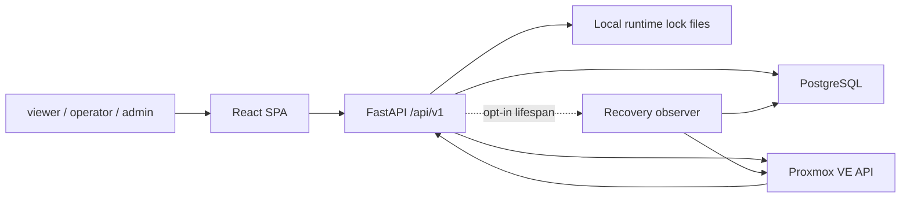

# 현재 아키텍처 기준선

- 상태: `APPROVED`
- 최종 검토일: `2026-07-23`
- 관련 ADR: 승인된 목표 [`ADR-001`](../decisions/adr-001-proxmox-gjallar-authority-boundary.md), [`ADR-002`](../decisions/adr-002-modular-monolith-domain-boundaries.md), [`ADR-003`](../decisions/adr-003-production-inventory-connection-truth.md), [`ADR-004`](../decisions/adr-004-postgresql-durable-operation-recovery.md), [`ADR-006`](../decisions/adr-006-drs-deprecation-and-insights-convergence.md); 철회된 결정 [`ADR-005`](../decisions/adr-005-drs-placement-and-operation-convergence.md)

이 문서는 2026-07-23 코드에 구현된 현재 구조를 설명한다. ADR과 전환 Plan의 목표 구조는 승인·구현 전까지 현재 구조가 아니다.

## 1. 시스템 목적과 경계

- 현재 해결 범위: 인증된 운영자에게 Workload Cockpit, 공통 Operations 목록·evidence timeline, Create VM, VM Start, graceful VM Shutdown, 첫 Guided `qm unlock`, observe-only Insights, DRS maintenance/policy/제한된 migration, jobs/legacy risks를 제공한다.
- 목표 제품 경계: neutral Placement/Capacity는 Insights/Monitoring에 유지하고 현재 DRS maintenance/policy/migration surface는 단계적으로 제거한다. DRS에는 신규 Common Operation, automatic recovery 또는 기능을 추가하지 않는다.
- 현재 시스템 책임: local user/session, Gjallar-owned operational records, `/api/v1`, React operator UI, Proxmox API 연동.
- 외부 책임: VM/node/task/config actual state와 실제 hypervisor mutation은 Proxmox가 소유한다.
- 현재 비범위: generic shell/SSH execution, broad lifecycle parity, VM Start/Shutdown 외 action의 자동 recovery, multi-cluster control.

## 2. 시스템 컨텍스트

- production image는 built React SPA를 FastAPI가 같은 origin에서 제공한다.
- startup은 Alembic upgrade, Create VM profile seed, optional bootstrap admin 후 Uvicorn을 시작한다.
- product runtime의 inventory는 authoritative Proxmox API만 사용한다. 필수 설정 누락은 `unconfigured`, snapshot 성공은 `live`, configured connection 실패는 `degraded`로 노출하며 fake fixture로 fallback하지 않는다.

## 3. 현재 아키텍처

- 구조: 단일 FastAPI application과 React SPA를 유지하며 feature-oriented layered monolith에서 domain-oriented modular monolith로 점진 전환 중이다.
- 선택 배경: 기능별 package와 단일 배포를 유지하며 빠르게 운영 기능을 확장해 왔다.
- 현재 장점: deployment가 단순하고 feature code와 contract test가 이미 존재하며 test-only fake adapter injection으로 주요 흐름을 검증할 수 있다.
- 현재 단점: HTTP route는 responsibility module로 분리됐지만 Create VM·DRS application facade는 DB, jobs, Proxmox concrete workflow를 직접 알고 있으며 dual record transaction 의미와 전환되지 않은 기능의 책임도 아직 분산돼 있다.
- 재검토 이유: 제품을 Verified Operations Control Plane으로 전환하려면 operation, policy, evidence의 공통 경계가 필요하다.

## 4. 구성 요소와 책임

| 구성 요소·모듈 | 현재 책임 | 공개 계약 | 현재 소유 데이터 | 주요 의존 대상 |
|---|---|---|---|---|
| `app/main.py`, auth routers | app lifecycle, middleware, login/admin API, SPA fallback | `/health`, `/api/v1/auth/*`, `/api/v1/admin/*` | user/session/account audit | DB, FastAPI |
| `api/v1/router.py` | `/api/v1` viewer dependency와 child router 조립 | `/api/v1/*` | 없음 | child router |
| `api/v1/inventory.py`, `operations.py`, `guided_qm.py`, `insights.py`, `jobs_compat.py`, `vm_actions.py`, `vm_create_compat.py`, `drs_compat.py` | inventory·Operation query·Guided `qm`·Insights·legacy Jobs/Risks·VM action·Create VM·DRS compatibility HTTP mapping | 기존 `/api/v1` read/action route | 없음 | `inventory_context` provider, Workloads, Operations/Insights/Jobs/VM action facade, Guided use case, Create VM·DRS application facade |
| `setup_integration` | redacted Proxmox connection truth와 failure 분류 | `ProxmoxConnectionStatus` | persistent state 없음 | Proxmox adapter |
| `workloads` | authoritative inventory availability application boundary | `WorkloadInventoryQuery` | actual state는 Proxmox 소유 | Setup/Integration, Proxmox adapter |
| `operations/core` | 공통 Operation 상태 전이, digest, projection/event repository 계약 | `OperationSpec`, `OperationSnapshot`, `OperationStore` | `operations`, `operation_events` | domain과 SQLAlchemy infrastructure adapter |
| `operations/locks`, `operations/recovery` | cluster/VMID durable locator coordination, due item, lease/generation fencing, allowlisted observation recovery | durable target lock repository, `RecoveryStorePort`, `OperationRecoveryRunner` | `operation_locks`, `operation_recovery_items` | PostgreSQL, Operations core, Proxmox read/task observation |
| `operations/vm_start` | VM Start command·stable intent, application use case, 검증 workflow와 외부 port 계약 | `VmStartCommand`, `VmStartUseCase`, `VmStartExecutionPorts` | 공통 operation/event와 기존 job/artifact dual record | 추상 Workloads/Mutation/Jobs/Evidence/Lock port |
| `operations/vm_shutdown` | graceful VM Shutdown command·stable intent, running pre-check, 검증 workflow와 외부 port 계약 | `VmShutdownCommand`, `VmShutdownUseCase`, `VmShutdownExecutionPorts` | 공통 operation/event/recovery와 기존 job/artifact dual record | 추상 Workloads/Mutation/Jobs/Evidence/Lock/Recovery port |
| `operations/vm_create` | Create VM stable intent, plan·approval·preview·dispatch·result·replay tracking과 common lifecycle mapping | `VmCreateOperationTracker`, facade functions | 공통 operation/event와 기존 request/job/artifact dual record | Operations core store; Create VM application facade가 compatibility workflow와 조립 |
| `operations/guided_qm` | 고정 `qm unlock` 계획, operator handoff, attestation, API verification | `GuidedQmUnlockUseCase`, typed command DTO | 공통 operation/event | Proxmox observation port, shared target lock |
| `proxmox` | read inventory와 mutation client | Python dataclass/client methods | actual state는 Proxmox 소유 | Proxmox VE API |
| `vm_create` | `application.py`의 draft→preflight→plan→approval→preview/execute orchestration과 compatibility 정책·runner | application result/error, workflow functions | profile, request, instance linkage, job/artifact | Operations Create VM tracking, DB, jobs, Proxmox |
| `vm_actions` | VM Start/Shutdown compatibility facade·infrastructure adapter와 post-create readiness | `run_vm_start`, `run_vm_shutdown`, action endpoint | 전용 table 없음; job/artifact compatibility 유지 | Operations VM lifecycle, inventory, jobs, Proxmox |
| `drs` | `application.py`의 advisor·policy·approval·migration/reconciliation orchestration과 identity·workflow 구현 | application result/error, workflow functions, `/drs/*` | DRS identity/policy/approval/job/lock/reconciliation | DB, inventory provider, jobs, 전용 DRS client provider |
| `jobs` | job projection과 artifact metadata/content | helper functions, `/jobs`, `/risks` | `job_runs`, `job_artifacts` | DB |
| `insights` | risk/readiness/capacity과 infrastructure-free neutral placement의 availability-aware derived read model | `InsightsQueryService`, `build_placement_model`, `/insights` | persistent data 없음 | Workloads observation, strict job read |
| `frontend/src/app` | auth/session, connection-aware route gate, shell, navigation composition | canonical route와 legacy alias | browser-local transient state | pages, shared |
| `frontend/src/pages`, `features`, `entities`, `shared` | route composition, Workload inventory, Operations·Guided `qm` 흐름, observe-only Insights, Operation·Insight read model, API/auth/connection 공통 계약 | `/instances`, `/operations*`, `/insights*`, `/api/v1` consumer | browser-local transient state | backend API; 미전환 page adapter는 기존 components/utils |

## 5. 현재 의존성 규칙

### 실제로 보호되는 관계

- `/api/v1`은 기본적으로 authenticated `viewer`를 요구하고 mutation은 `operator`, account admin은 `admin`을 요구한다.
- `api/v1/router.py`가 공통 prefix/dependency를 가진 composition root이며 query·VM action·Guided `qm`·Create VM·DRS compatibility child router만 포함한다. inventory query/adapter 선택은 `api/v1/inventory_context.py` provider 경계로 공유한다. 52개 route의 method·path·name·status와 viewer/operator/admin dependency는 `test_api_v1_route_registry.py` characterization contract로 보호한다.
- inventory read adapter와 mutation client는 분리돼 있다.
- product environment mode는 live-only이고 test fixture는 direct injection으로만 연결된다.
- inventory-dependent route는 Workloads query boundary에서 non-live 상태를 `503`으로 차단한다.
- VM Start/Shutdown HTTP path는 `api/v1/vm_actions.py`에서 authenticated actor, inventory/client provider와 HTTP error를 mapping한 뒤 compatibility facade를 통해 infrastructure-free command와 application use case로 진입한다. use case가 사용하는 Workloads, mutation, Jobs, Evidence, lock, recovery 의존성은 명시적 port로 전달된다.
- Create VM HTTP path는 `api/v1/vm_create_compat.py`가 operator dependency, inventory provider, success envelope와 `VmCreateApplicationError`→`HTTPException` 변환만 담당한다. `vm_create/application.py`가 기존 draft→preflight→plan→approval→preview/execute 순서, idempotency guard, target lock, Operation evidence와 compatibility DB/job/artifact 기록을 소유한다.
- DRS HTTP path는 `api/v1/drs_compat.py`가 viewer/operator dependency, inventory·risk·전용 migration client provider, success envelope와 `DrsApplicationError`→`HTTPException` 변환을 담당한다. `drs/application.py`가 recommendation/check, explicit candidate acknowledgement, policy, approval, execute/reconcile 순서를 조립하며 FastAPI·Starlette·`app.api`에 의존하지 않는다.
- Guided `qm` HTTP path는 `api/v1/guided_qm.py`가 operator dependency, observation client provider와 `GuidedQmError`→`HTTPException` 변환을 담당하고 `operations/guided_qm` use case를 호출한다.
- VM Start, VM Shutdown, Create VM tracking과 Guided `qm unlock`은 공통 Operation projection과 checksum-linked event repository를 사용한다. DRS migration은 아직 기존 전용 state와 reconciliation을 사용한다.
- VM Start, VM Shutdown, Create VM, Guided `qm unlock`, DRS의 같은 `cluster_id`/VMID locator는 PostgreSQL partial unique lock을 공유한다. local file lock은 전환 중 compatibility guard로 DB lock 뒤에 획득한다.
- VM Start/Shutdown은 external dispatch 전 recovery item과 foreground lease를 저장하고 task polling 중 heartbeat한다. opt-in recovery runner는 만료된 lease를 `SKIP LOCKED`로 하나씩 claim하며 저장된 task와 direct VM state만 GET으로 재관찰한다.
- Create VM plan은 `operation_id=job_id`인 `vm_create` operation을 만들고 approval·preview·dispatch·running·verifying·success/reconciliation을 event로 기록한다. 기존 request/workload/job/artifact는 별도 transaction의 compatibility record로 유지한다.
- Guided `qm`은 fixed template과 typed parameter만 받으며 backend shell/SSH executor가 없다. operator attestation만으로 성공하지 않고 Proxmox API의 config lock·active task를 다시 확인한다.
- DRS migration은 일반 Proxmox mutation client와 다른 전용 client를 사용한다.
- browser가 제출한 actor가 아니라 server-side session actor를 사용한다.
- secret-like field를 API와 evidence에서 거부·redact하는 경로가 있다.
- Insights는 `api facade → application → domain/read ports` 방향으로 risk와 inventory source를 독립 수집한다. `insights/placement.py`가 inventory normalization, pressure/candidate/route 계산을 소유하고 DRS identity/policy/lock 또는 DB write에 의존하지 않는다. DRS advisor는 neutral recommendation에 maintenance gate를 보강한다. source 실패는 section별 `unavailable`로 격리하고 어떤 approval·operation·mutation port도 제공하지 않는다.
- frontend 전환 영역은 `app → pages/features → entities/shared` 방향을 source contract로 검사한다. app은 legacy component를 직접 import하지 않고, Workload inventory, Guided `qm`, Insights는 feature public boundary를 사용한다.

### 일관되게 보호되지 않는 관계

- Create VM·DRS application facade는 아직 DB session, ORM model, job/artifact helper, Proxmox concrete workflow를 직접 알 수 있다.
- 미전환 backend domain과 legacy frontend screen에는 public contract와 private implementation 경계가 일관되게 적용되지 않았다.
- Create VM·DRS maintenance·Jobs·legacy Risks·Admin frontend 내부는 page adapter 아래 기존 component/utils 구조를 유지한다.
- DRS migration은 identity/policy/approval/job/reconciliation과 Jobs/Artifacts를 포함한 제거 대상 compatibility 모델로 남아 있다. Common Operation과 automatic recovery handler는 없고 추가하지 않으며, 제거 전까지 operator reconciliation만 제공한다.

## 6. 현재 책임과 데이터

| 현재 책임 영역 | 핵심 책임 | 소유 상태·데이터 | 다른 영역과의 현재 계약 |
|---|---|---|---|
| Auth | 사용자, role, session, account audit | `users`, `sessions`, `account_audit_events` | FastAPI dependency, authenticated actor |
| Inventory | Proxmox state read/normalization | actual state는 Proxmox; adapter cache는 transient | nodes/VMs/templates/storage/networks model |
| VM Create | profile, request, create workflow | `create_vm_profiles`, `vm_create_requests`, `vm_instances` 및 job/artifact | `/vm-create/*`, Proxmox client |
| VM Actions | existing VM action/readiness | 전용 table 없이 `job_runs`, `job_artifacts` | action endpoint, inventory, Proxmox client |
| Operations | operation current projection, append-only event, durable target coordination와 recovery lease | `operations`, `operation_events`, `operation_locks`, `operation_recovery_items` | VM Start/Shutdown, Create VM, Guided `qm`, additive operation API |
| DRS | identity, policy, recommendation, execution/reconciliation | DRS 관련 8개 table과 job/artifact | `/drs/*`, inventory, DRS client |
| Jobs/Risks | 최신 job projection, artifact, derived risk | `job_runs`, `job_artifacts` | `/jobs`, `/risks`, producer helper |
| Insights | source별 derived finding, availability와 neutral placement | persistent state 없음; request-time projection | `/insights`, Workloads observation, Jobs risk |

물리적인 ORM model은 대부분 `backend/app/db/models.py`에 함께 있다. Operations core의 두 model은 `backend/app/operations/core/infrastructure/models.py`로 분리됐지만 Create VM·DRS 등 나머지 repository ownership은 아직 분리되지 않았다. 목표 logical ownership은 [`domains/domain-map.md`](../domains/domain-map.md)에 제안한다.

## 7. 트랜잭션과 정합성

- DB transaction: `session_scope()`를 호출하는 helper/service 단위이며 정상 commit, exception rollback이다.
- 공통 Operations repository는 projection 변경과 event append를 한 transaction으로 처리하고 sequence/version 충돌을 거부한다. recovery transition은 lease fencing, event/projection, recovery status와 target lock release를 같은 transaction으로 처리한다. 기존 job/artifact compatibility 기록은 workflow별 별도 transaction이다.
- 강한 정합성: 단일 DB transaction 안의 unique/foreign-key/checksum/last-admin 같은 local invariant.
- 최종 정합성: Proxmox mutation, UPID/task, post-check와 Gjallar job/DRS state. 외부 API와 PostgreSQL은 원자적이지 않다.
- 멱등성·동시성: VM Start, VM Shutdown, Create VM, Guided `qm unlock`, DRS는 현재 한 configured cluster의 VMID locator에 대해 같은 PostgreSQL open-lock unique constraint를 공유한다. Start/Shutdown/Create/Guided는 transition 기간 local file guard도 함께 사용한다. recovery lease expiry는 observer takeover만 허용하며 target lock을 해제하지 않는다.
- 실패 처리: VM Start, VM Shutdown, Create VM과 Guided `qm`은 공통 `needs_reconciliation` taxonomy와 Operation event를 사용한다. DRS는 전용 prepared/accepted evidence와 operator reconciliation 규칙을 사용하며, prepared 이후 UPID가 불명확하면 second mutation 없이 lock을 보존한다.

## 8. 외부 시스템

| 시스템 | 목적 | 호출 방향 | 현재 실패 격리 | 계약 위치 |
|---|---|---|---|---|
| Proxmox VE API | inventory, VM create/start/graceful shutdown/migrate, task/post-check | Gjallar → Proxmox | adapter/client 분리, timeout, workflow별 gate와 task evidence | `backend/app/proxmox/` |
| PostgreSQL | Gjallar-owned users와 operational state | Gjallar → PostgreSQL | `session_scope`, Alembic, test-only SQLite guard | `backend/app/db/`, `backend/alembic/` |
| Browser | operator UI와 session cookie | Browser ↔ Gjallar | HttpOnly cookie, origin validation, RBAC | `frontend/src/`, auth/API routers |
| Local filesystem | VM Start/Shutdown/Create VM/Guided `qm` compatibility target guard | backend local process | PostgreSQL durable lock 뒤 dual acquire; container 내 구버전 경로 방어 | `backend/app/operations/target_lock.py` |

Queue, scheduler, cache는 현재 active dependency가 아니다. recovery observer는 별도 서비스가 아니라 같은 FastAPI image의 opt-in lifespan task다.

## 9. 현재 주요 실행 흐름

- Create VM: draft → preflight → plan과 common operation 준비 → approve/preview event → replay/VMID guard → target lock → common dispatch 기록 → native create → running/verifying event → compatibility request/workload/job/artifact → common success → clear result에서만 lock 해제.
- VM Start: API facade → Operations command/use case → explicit execution ports → `operations/vm_start/workflow.py` 순으로 진입한다. acknowledgement/idempotency → operation intent/event → durable+file target lock → fresh pre-check → recovery item/foreground lease → start → lease heartbeat/task poll → running post-check → fenced operation event + 기존 job/artifact → clear result에서만 lock 해제 순서를 유지한다.
- VM Start restart recovery: foreground lease expiry → opt-in runner claim → stored UPID task GET → direct VM status GET → fenced transition/evidence. runner는 mutation POST를 받지 않으며 missing UPID·task/state mismatch는 `needs_reconciliation`/`paused`와 retained target lock으로 남긴다.
- VM Shutdown: 같은 의존 방향과 durable ordering을 사용하되 running non-template pre-check 뒤 QEMU `status/shutdown`만 호출한다. task `stopped/OK`와 direct VM `stopped`가 모두 확인되고 Jobs projection이 저장된 뒤 fenced completion과 lock release를 수행한다.
- VM Shutdown restart recovery: `vm_shutdown_observation` handler는 stored UPID task와 direct VM status GET만 사용한다. shutdown POST, hard stop, reboot capability가 없으며 missing UPID·task/state mismatch는 paused reconciliation과 retained lock이다.
- Guided `qm unlock`: Workload Cockpit 또는 Operations UI → typed input/ack → shared target lock → `Sys.Audit` 권한·active task·config lock pre-check → 5분 instruction bundle과 operation/event 저장 → 외부 node shell 실행 → trusted attestation → Proxmox API verification → lock 해제 또는 reconciliation 순서다. backend는 명령을 실행하지 않으며 UI는 만료·reconciliation instruction의 신규 실행을 경고한다.
- DRS: compatibility HTTP boundary → application facade → neutral placement에 identity/policy gate 보강 → approval artifact/packet/job → final pre-check → authenticated actor 소유 DB lock → DRS `prepared` → migrate → accepted UPID → task/post-check completion 또는 operator reconciliation.
- Insights: authenticated read → strict Jobs risk와 Proxmox connection observation 독립 수집 → live이면 readiness/capacity와 neutral placement 계산 → source별 provenance·version·freshness·bounded finding 조합. placement는 DRS persistence를 호출하지 않는다. non-live에서는 stored risk만 유지하고 inventory section은 `unavailable`이며 실행 경로는 없다.
- 목표 공통 lifecycle 중 projection/event core, VM Start·graceful VM Shutdown·Create VM·Guided `qm unlock`, Workload Cockpit·Operations list/detail/timeline UI가 구현됐다. DRS는 제거와 Insights/Monitoring 통합 범위 확정이 남아 있다.

## 10. 런타임과 배포 제약

- 실행 단위: React build와 FastAPI를 포함한 single Docker image.
- 환경 경계: local dev는 Vite `5173`과 FastAPI `8000`; production은 same-origin SPA/API.
- 성능·확장: 정량 SLA와 horizontal scale contract가 없다. PostgreSQL lock/lease는 multi-replica claim을 조정하지만 recovery는 API process와 resource를 공유하고 concurrency 1로 제한된다.
- 시크릿·네트워크: PostgreSQL과 Proxmox credential은 environment/orchestrator secret으로 주입한다.

## 11. 테스트 경계

- 단위: DRS 판단, identity, preflight, view model, normalization 등 순수·준순수 로직.
- 통합·계약: FastAPI `/api/v1`, auth/RBAC, SQLAlchemy/Alembic, jobs/artifacts, static SPA, frontend client/route.
- 외부 대역: test에서 직접 주입한 fake inventory/mutation client와 test-only SQLite를 기본 사용한다. product runtime environment에는 fake inventory mode가 없다.
- neutral Placement와 router/application 경계를 보존한 롤백 후 local Python 3.14 backend 전체 `514 passed, 2 skipped`, DRS·route·Placement 집중 `120 passed`, 관련 module `py_compile`과 `git diff --check`를 확인했다. 직전 canonical Python 3.13 container backend 전체 `504 passed, 2 skipped`, canonical Node 24/pnpm 10 frontend와 production image build, 실제 PostgreSQL 18.4 integration `2 passed`는 이전 기준선이다. live DRS migration은 수행하지 않았다.

## 12. 알려진 위험과 기술 부채

- 조회·VM action·Guided `qm`·Create VM·DRS route는 `api/v1/{inventory,operations,guided_qm,insights,jobs_compat,vm_actions,vm_create_compat,drs_compat}.py`로 분리했고 Create VM·DRS orchestration은 각 `application.py`로 이동했다. application facade의 concrete workflow 의존과 미전환 큰 screen/view-model의 책임 집중은 계속된다.
- VM Start/Shutdown과 Create VM lifecycle은 Operations에 연결됐지만 기존 `job_runs`/`job_artifacts`와 Create VM request/workload linkage가 남아 있다. `job_runs`는 VM Start/Shutdown의 멱등 replay와 recovery terminal projection에도 사용되고 common Operation detail은 artifact content 저장·metadata 조회를 아직 대체하지 않는다. DRS는 전용 state와 compatibility facade를 유지한 채 제거 방향의 후속 설계가 필요하다.
- 기존 `/jobs`·`/risks`가 사용하는 `list_job_runs()`의 DB exception → empty list fallback은 호환성 때문에 남아 있다. `/insights`는 `list_job_runs_strict()`로 risk source 장애를 `unavailable`로 표시한다.
- `job_runs`는 최신 projection, `job_artifacts`는 upsert 성격이라 immutable operation audit가 아니다.
- durable restart recovery는 VM Start/Shutdown observation에 구현됐다. Create VM과 Guided `qm`에는 공통 자동 handler가 없고 generic operator recovery/unlock API도 없다. DRS automatic recovery는 `ADR-006`에 따라 구현 대상이 아니다.
- local file guard는 container 교체 시 유실될 수 있지만 canonical 충돌 방어는 PostgreSQL locator lock이다. rolling deploy에서 구버전 replica가 durable lock을 무시하지 않도록 mutation drain이 필요하다.
- Guided instruction이 발급된 뒤 외부 Proxmox 도구가 별도 작업을 시작하는 경쟁은 local lock으로 차단할 수 없다. active-task double read, 짧은 expiry, API after-state verification으로 성공 오판을 방지하지만 live cluster 검증은 수행하지 않았다.
- 현재 target identity는 한 configured cluster 안의 VMID를 전제한다. multi-cluster를 지원하려면 stable cluster identity를 포함해야 한다.
- target identity는 configured `GJALLAR_CLUSTER_ID`와 VMID를 사용한다. multi-cluster connection profile과 cluster별 worker partition은 아직 없다.
- stale snapshot persistence가 없어 Proxmox가 `degraded`이면 이전 inventory를 read-only로 열람할 수 없다.
- `live` connection은 inventory read 성공을 뜻할 뿐 token의 mutation permission discovery는 아직 제공하지 않는다. mutation은 기존 RBAC·approval·Proxmox response gate를 계속 사용한다.
- backend dependency lock은 마련됐지만 formatter/lint/type-check 기준은 아직 없다.
