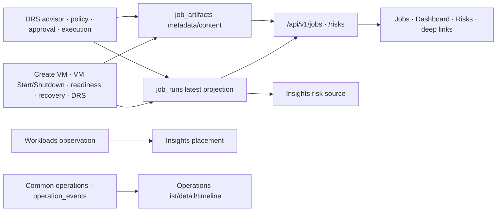

# DRS·Jobs/Artifacts Legacy Convergence Assessment

> 해결된 과거 조사 기록이다. 아래의 상태·의존성 설명은 당시 snapshot이며 현재 구현은 [아키텍처](../../architecture/overview.md)를 따른다.

- 상태: `RESOLVED`
- 조사일: `2026-07-23`; 제품 방향 재검토 `2026-08-24`
- 관련 Plan: [`Backend 모듈 경계·legacy 격리`](../plans/2026-07-23-backend-modular-boundaries-and-legacy-compatibility.md)
- 관련 Architecture·ADR: [`현재 기준선`](../../architecture/overview.md), [`ADR-002`](../../decisions/adr-002-modular-monolith-domain-boundaries.md), [`ADR-007`](../../decisions/adr-007-observe-first-operations-intelligence.md)
- 철회된 ADR: [`ADR-005`](../../decisions/adr-005-drs-placement-and-operation-convergence.md) (`REJECTED`, 역사 기록)
- 현재 방향: `DRS 전용 UI·API·runtime·schema contract 제거 완료; shared Jobs/Artifacts는 별도 책임으로 보존`
- 철회된 Plan: [`DRS Placement·Common Operation 전환`](../plans/2026-07-23-drs-placement-and-common-operation-convergence.md) (`ROLLED_BACK`)

## 결론

2026-08-24 사용자가 운영 배포·외부 DRS consumer·보존할 production DRS state가 없다는 전제를 수락하고 repository full removal을 승인했다. 그 결과 DRS 전용 frontend·API·runtime·config·ORM/table contract는 신규 Operations로 이전하지 않고 제거됐으며, `job_runs`, `job_artifacts`, generic `operation_locks`, Jobs의 historical renderer와 `/insights` legacy source·ID 값은 보존됐다. 실제 production DB migration 적용, data 삭제, 외부 credential revoke와 live Proxmox mutation은 수행하지 않았다.

아래 내용은 이 결론에 이르기 전 2026-07-23~2026-08-24 조사 snapshot과 선택지 기록이다. 현재 구현 기준선은 [`overview.md`](../../architecture/overview.md), 현재 DB/API 계약은 각각 [`current-schema-and-ownership.md`](../../database/current-schema-and-ownership.md), [`current-api-v1.md`](../../api/current-api-v1.md)를 따른다.

DRS와 Jobs/Artifacts는 서로 다른 전환 문제다. 사용자는 DRS maintenance 기능을 유지·확장하는 선택지 A가 아니라 DRS를 제거하고 제품 surface를 Insights/Monitoring으로 통합하려는 방향을 명확히 했다.

- DRS의 placement recommendation 제품 화면은 이미 `/insights/placement`가 canonical이다. 그러나 `/drs` maintenance 화면과 `/api/v1/drs/*`는 policy, exact approval, migration execution, reconciliation과 이력을 계속 제공한다.
- `job_runs`는 단순 목록용 복제본이 아니다. VM Start/Shutdown workflow가 멱등 재실행 여부와 기존 결과를 먼저 판단할 때 읽고, restart recovery가 terminal 결과를 기록한 뒤 target lock을 해제하는 데도 사용한다.
- `job_artifacts`는 Create VM, VM Start/Shutdown, post-create readiness와 DRS의 상세 증적 content를 저장하고 `/jobs/{job_id}/artifacts`는 metadata를 노출한다. 현재 공통 Operation 상세는 상태와 checksum-linked event timeline을 제공하지만 이 저장·조회 책임을 대체하지 않는다.
- 따라서 현재 방향은 **neutral Placement는 Insights에 유지하고, DRS maintenance의 실제 consumer·보존 이력을 확인한 뒤 policy/approval/execution/reconciliation/API/UI를 단계적으로 제거하는 것**이다. Jobs/Artifacts는 DRS 제거와 분리해 producer/consumer parity를 확인한 뒤 전환한다.

잘못 이해해 구현했던 DRS Common Operation dual record는 롤백했다. 유지된 변경은 placement 계산을 `backend/app/insights/placement.py`로 분리한 부분과 router/application 경계뿐이다. 현재 DRS API/UI/table은 아직 제거되지 않았으며, 데이터 삭제·backfill·live mutation도 수행하지 않았다.

## 현재 의존 구조

공통 Operation과 Jobs는 현재 경쟁하는 두 독립 진실 원본이라기보다, 일부 workflow에서 동시에 기록되는 execution truth와 compatibility projection이다. 다만 VM Start/Shutdown의 기존 결과 재사용과 recovery 완료 순서에 Jobs가 남아 있어 아직 완전히 파생 가능한 projection도 아니다.

## Producer와 실행 의존성

| Producer | 현재 Jobs/Artifacts 사용 | 공통 Operation 상태 | 제거 전 필요한 대체 |
|---|---|---|---|
| VM Start | `job_runs`를 재실행·intent 충돌 판단과 결과 반환에 사용, 단계별 projection과 observed artifact 기록 | operation/event/recovery 구현됨 | 멱등 replay를 Operation intent/result로 전환하고 recovery의 Jobs terminal projection 의존 제거 |
| VM Shutdown | Start와 같은 replay 판단, 단계별 projection, shutdown artifact, recovery terminal projection | operation/event/recovery 구현됨 | Operation 기반 replay/result와 recovery 완료 순서로 전환 |
| Create VM | draft/preflight/plan/execute 결과와 artifact 기록, 화면 deep link | plan 이후 operation/event를 dual record | 기존 draft/request/workload linkage와 artifact query를 Operation/Evidence 계약으로 연결 |
| Post-create readiness | 독립 job과 readiness artifact 기록 | 공통 Operation 없음 | Operation에 포함할지 observe-only 검사로 둘지 책임 결정 |
| DRS approval/execution | approval/job intent/execution/reconciliation projection과 artifacts 기록 | Common Operation 미연결; 전용 상태기계 유지 | 제거 대상 consumer, 이력 보존, Insights/Monitoring 대체 범위 |
| Restart recovery | VM Start/Shutdown terminal Jobs projection이 존재해야 완료·unlock 가능 | recovery item/lease/fenced transition 구현됨 | terminal result의 canonical read model을 Operation으로 바꾸고 artifact append 실패 규칙 확정 |

`backend/app/operations/vm_start/workflow.py`와 `vm_shutdown/workflow.py`는 요청 시작 시 `ports.jobs.get(job_id)`를 먼저 확인한다. 같은 `operation_id`가 있는데 호환 job이 없으면 자동 계속하지 않고 reconciliation-required로 차단한다. 그러므로 Jobs table만 제거하는 것은 UI 정리가 아니라 실행 의미 변경이다.

## Consumer와 공개 계약

| Consumer | 현재 계약 | 전환 시 공백 |
|---|---|---|
| Jobs 화면 | `/jobs`, `/jobs/{job_id}`, `/jobs/{job_id}/artifacts`, 2.5초 polling | Operation detail에 job별 step/progress/risk/artifact 요약이 없음 |
| Dashboard | Jobs와 legacy Risks 목록 | 공통 Operation 기반 최근 활동·위험 query가 없음 |
| Risks 화면 | `/risks`의 job-derived risk | Operation/Evidence 기반 risk rule source가 없음 |
| Insights risk | strict `job_runs` read를 source availability와 함께 사용 | risk source를 Operation/event 또는 별도 finding으로 옮겨야 함 |
| Create VM·Workload·DRS deep link | `/operations/jobs?job=...` | operation type별 canonical detail link와 표시 parity 필요 |
| DRS maintenance UI | advisor/check/approval/policy/reconcile-preview; live execute control은 없음 | policy/history/reconciliation을 Insights placement만으로 대체할 수 없음 |
| 외부 `/api/v1` 소비자 | 저장소 안에서는 확인 불가 | 사용량 관찰·deprecation 기간 없이 route 제거 불가 |

`list_job_runs()`가 DB 오류를 빈 목록으로 축소하는 기존 `/jobs`·`/risks` 의미도 공개 호환 계약에 포함된다. 새 Insights는 `list_job_runs_strict()`를 사용해 장애를 `unavailable`로 드러내므로, 두 의미를 조용히 합치면 안 된다.

## 공통 Operation 대체 가능성

| 책임 | 현재 Operation으로 대체 가능 | 아직 부족한 부분 |
|---|---|---|
| 실행 ID, target, type, actor, idempotency, current status | 가능 | 기존 job type별 response/result mapping |
| 상태 전이와 시간순 evidence | 가능 | artifact 저장·metadata 조회와 job step/progress 표현 |
| VM Start/Shutdown restart recovery와 locator lock | 가능 | recovery terminal Jobs projection 의존 제거 |
| DRS migration lifecycle | 현재 대체하지 않음 | DRS execution 폐기; 향후 일반 VM migration이 필요하면 별도 제품 결정과 action Plan 필요 |
| DRS stable identity와 observation | Operation 소유가 아님 | 목표 owner를 자동 지정하지 않는다. neutral Workloads observation에 필요한 field와 실제 consumer가 확인된 경우에만 별도 Plan으로 재설계 |
| DRS migration policy와 exact approval packet | Operation 소유가 아님 | DRS 기능과 함께 제거 대상. generic Policy/Approval 계약으로 승격하지 않음 |
| artifact와 audit | event payload 일부만 가능 | redacted artifact 저장·metadata query·내부 content read, append-only identity, retention |
| risk/insight | 직접 대체하지 않음 | Operation/Evidence 기반 finding rule과 availability contract |

DRS 전용 table에 generic 목표 owner를 배정하는 것은 현재 제품 방향과 맞지 않는다. `drs_migration_jobs`와 reconciliation execution state는 새 Operations 계약으로 이전하지 않고 active state를 모두 해소한 뒤 제거한다. `vm_identities`와 observation도 DRS origin만으로 Workloads에 승격하지 않으며, 실제 neutral consumer가 확인된 field만 별도 Plan에서 재설계한다. 보존이 승인된 artifact/history만 Evidence/Audit 책임으로 남긴다.

## 선택지

| 선택지 | 내용 | 장점 | 비용·위험 |
|---|---|---|---|
| A. 점진 통합과 신규 legacy 의존 동결 | DRS maintenance API/UI와 전용 table은 유지한다. DRS execution부터 common Operation에 연결하고 Jobs/Artifacts 신규 사용을 금지한 뒤 consumer별로 전환한다. | 현재 기능·이력·공개 계약을 보존하면서 목표 경계로 이동 가능 | 과도기 dual record, backfill·정합성 검증과 후속 Plan 필요 |
| B. 현재 compatibility 구조 장기 유지 | 격리된 `drs_compat`, `jobs_compat` 경계를 유지하고 추가 전환을 하지 않는다. | 단기 비용과 회귀 위험이 가장 낮음 | 두 상태기계·projection·화면 유지 비용과 DB 오류 의미가 계속 남음 |
| C. DRS maintenance 단계적 폐기 | Insights placement만 남기고 DRS policy/approval/execution/history API와 화면을 deprecate한 뒤 제거한다. Jobs 전환은 별도로 수행한다. | 제품 표면과 DRS 전용 실행 코드가 줄어듦 | 현재 policy/history/reconciliation 대체가 없고 외부 소비자·보존 정책 확인 필요 |

사용자는 DRS 제거와 Insights/Monitoring 통합 방향을 확인했다. 다만 삭제 대상 API/UI/table과 보존할 이력, 외부 consumer가 아직 확정되지 않았으므로 실제 contract/data 제거는 후속 high-risk Plan과 별도 승인이 필요하다.

## 현재 권장 전환 순서

1. 완료 — `job_runs`/`job_artifacts`와 DRS 전용 execution 구조에 신규 producer·consumer를 추가하지 않는 방향을 확정했다.
2. 완료 — placement 계산을 DRS 실행 package에서 neutral Insights/placement 경계로 옮기고 공개 결과를 유지했다.
3. 다음 — DRS route/UI/policy/approval/execution/reconciliation과 Jobs/Artifacts 의존을 consumer 단위로 분류한다.
4. Insights/Monitoring에 필요한 최소 read-only placement/capacity/history 보존 범위를 정의한다. DRS policy·approval·execution·reconciliation 기능 parity는 재구현하지 않는다.
5. DRS live migration 기능을 폐기한다. 향후 일반 VM migration operation이 필요하면 DRS 전환과 분리한 새 제품 결정으로 다룬다.
6. 저장소 내부 consumer가 0이 된 뒤 외부 API 사용량과 retention을 확인하고 DRS maintenance 계약을 deprecate한다.
7. 마지막 contract 단계에서만 별도 승인된 migration으로 불필요한 DRS table을 제거한다. Jobs/Artifacts 전환은 독립 Plan으로 수행한다.

## Contract 단계 진입 조건

### DRS maintenance 제거

- DRS의 신규 policy·approval·execution·reconciliation 기능과 producer/consumer 추가가 동결돼 있다.
- 저장소 내부 DRS consumer가 0이거나 승인된 최소 read-only Insights/Monitoring 계약만 사용한다.
- 열린 DRS job·lock·reconciliation 상태의 처리 방법과 history retention 또는 archive 범위가 승인됐다.
- 공개 API 외부 사용량 또는 명시적 deprecation 기간을 확인했다.
- 제거 과정에서 Common Operation 통합, automatic recovery 또는 DRS 기능 parity를 새로 만들지 않는다.
- rollback 또는 forward correction 절차가 PostgreSQL integration test로 검증됐다.

### Jobs/Artifacts 전환

- DRS 제거와 독립된 Plan에서 기존 producer와 frontend/backend consumer가 0이거나 승인된 replacement를 사용한다.
- Operation/Evidence 전환이 필요한 consumer에 한해 status, replay, actor, task, artifact와 risk 표시 계약을 검증한다.
- 기존 row backfill과 전환 대조가 idempotent하고 불명확한 상태를 성공으로 바꾸지 않는다.
- recovery와 open lock이 legacy projection 없이도 안전하게 완료·보존된다.
- artifact/evidence retention과 삭제 정책이 승인됐다.

## 아직 확인되지 않은 운영 정보

- 현재 production DB의 DRS/job/artifact row 수와 보존 기간
- 저장소 밖 `/api/v1/drs/*`, `/jobs`, `/risks` 소비자
- DRS history에서 Insights/Monitoring 또는 Evidence/Audit로 보존할 read model과 retention
- DRS contract 제거 전까지 기존 operator reconciliation을 지원해야 하는 기간

이 항목들은 실제 contract/data 제거를 제안하기 전 후속 Plan의 입력으로 수집한다. DRS automatic recovery나 Common Operation 통합은 제안 대상이 아니다. 조사와 구현 단계에서 production DB query/backfill, live DRS mutation, Alembic schema 변경은 수행하지 않았고 기존 13개 DRS API와 Jobs/Artifacts 계약은 유지했다.
