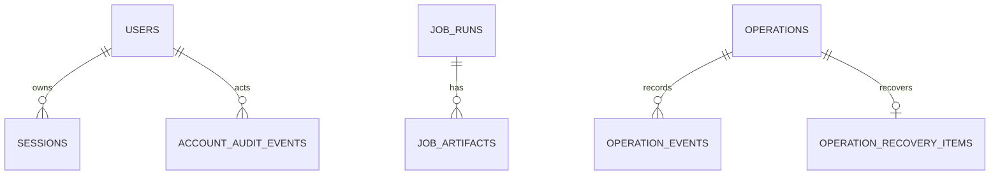

# 데이터베이스 기준선: 현재 Schema와 목표 Logical Ownership

- 상태: `APPROVED`
- 최종 검토일: `2026-09-07`
- 부분 검토: `2026-09-14`, 요청 파일 잠금 제거와 프리셋·이력 보존 정책
- 관련 migration·ADR: `backend/alembic/versions/`, [`ADR-002`](../decisions/adr-002-modular-monolith-domain-boundaries.md), [`ADR-004`](../decisions/adr-004-postgresql-durable-operation-recovery.md), [`ADR-007`](../decisions/adr-007-observe-first-operations-intelligence.md), [`ADR-008`](../decisions/adr-008-template-based-create-and-persistence-simplification.md)

## 목적과 범위

- 현재 PostgreSQL schema와 table 역할을 코드 기준으로 보존한다.
- 현재 구현된 schema와 목표 domain ownership을 구분한다. ORM table은 12개이며 repository의 migration head는 `20260824_0029`다. 이 값은 연결된 실제 DB의 적용 상태를 확인했다는 의미가 아니다.
- 적용된 Alembic migration은 절대 삭제·수정·재번호화하지 않는다.
- 상세 column/type는 `backend/app/db/models.py`, `operations/core/infrastructure/models.py`, `operations/recovery/infrastructure/models.py`와 Alembic revision이 우선한다.

## 데이터 소유권

| 현재 table | 현재 역할 | 목표 logical owner | 변경 권한·읽기 계약 |
|---|---|---|---|
| `users` | local account, role, enabled state | Access | Access command/query |
| `sessions` | server-side login session | Access | Access만 발급·revoke; auth dependency가 조회 |
| `account_audit_events` | account operation audit | Evidence/Audit, producer Access | append/query; actor와 redaction 보존 |
| `create_vm_profiles` | 생성 기본값·hardware 한도·template/access 검증 규칙; 선택한 프리셋 경로의 의존성; template 직접 입력은 조회하지 않음 | Workloads | 현재 `db/create_vm_profiles.py`를 `vm_create`에서 조회; 독립 Workloads profile command/query는 목표 경계 |
| `vm_create_requests` | Create VM request/result record | Operations | Create operation projection/linkage |
| `vm_instances` | 과거 Create의 exact history reader만 사용; 신규 writer 없음 | 과거 데이터 보존 | 현재 VM 상태·소유권 판단에 사용 금지 |
| `job_runs` | latest job state projection | Operations | compatibility projection; audit source로 사용 금지 |
| `job_artifacts` | job artifact metadata/content | Evidence/Audit | 현재 upsert 의미를 append-only evidence와 분리 필요 |
| `operations` | 공통 operation current projection | Operations | target/action/mode/status/idempotency/digest/trusted actor/version의 canonical projection |
| `operation_events` | operation 상태 전이·evidence event | Evidence/Audit, producer Operations | operation별 monotonic sequence와 SHA-256 checksum chain; application update/delete 없음 |
| `operation_recovery_items` | operation별 due work, observer lease/fencing과 redacted recovery 상태 | Operations | VM Start/Shutdown/Create/Guided foreground, allowlisted runner와 operator observe coordinator가 write; token은 API/evidence에 노출하지 않음 |
| `operation_locks` | 공통 Proxmox locator durable lock | Operations | 네 지원 action의 cross-operation open-locator invariant 보존 |

## 현재 모델 관계

이 그림은 주요 업무 관계만 표현하며 exact foreign key는 ORM/Alembic이 우선한다.

## 현재 트랜잭션과 정합성

`backend/app/db/session.py`의 `session_scope()`가 commit/rollback 경계다. 외부 Proxmox mutation·task·post-check와 DB는 한 transaction으로 묶이지 않는다. job/artifact helper도 호출마다 별도 transaction을 만들 수 있으므로 “한 작업의 기록이 모두 원자적”이라고 설명하지 않는다.

| 경로 | 실제 DB commit 경계 | 남을 수 있는 중간 상태 |
|---|---|---|
| Operation create/transition | projection과 대응 checksum-linked event append를 같은 transaction에 기록 | Proxmox task와 compatibility Jobs는 별도 기록 |
| Start/Shutdown mutation client·recovery 등록 실패 | no-effect failed Jobs를 먼저 commit; Operation row 아래 `planned`·recovery item 부재·exact owned lock을 확인해 failed event/projection commit 후 별도 lock release | failed Jobs 뒤 replay/recovery가 먼저 진입하면 해당 owner가 canonical 완료와 lock release를 담당 |
| Start/Shutdown foreground 완료 | terminal Operation + recovery `leased` → Jobs 저장 → recovery completion event·status + lock release를 각각 commit | Operation이 `succeeded`/`failed`인데 Jobs 또는 recovery·lock 정리는 미완결 |
| Start/Shutdown restart recovery 완료 | terminal Operation을 먼저 commit; terminal Jobs projector + completion event·recovery + lock release를 한 transaction에 기록 | 앞선 terminal Operation 전이는 final projection transaction과 분리 |
| Create foreground/restart recovery 성공 | readiness checkpoint 뒤 request/job/artifact·Operation 결과 projector + 최종 `succeeded` event/projection + recovery completion + lock release를 한 transaction에 기록 | 검증 evidence는 있으나 최종 projector 실패로 `succeeded` 미확정·lock retained |

`SqlAlchemyRecoveryStore.commit_observation()`은 유효 lease generation/token/expiry를 확인하고 Operation row를 잠근다. expected Operation version/checksum이 전달된 경우 함께 검증한 뒤 exact locator lock을 확인한다. local projector가 있는 호출은 이 검사 이후 caller-owned `Session`을 전달하므로 오래된 lease로 compatibility만 완료할 수 없다. event append·projector·lock 변경 중 예외가 나면 해당 transaction을 rollback한다.

네 action의 파일 잠금 생성·cleanup·port는 제거됐다. PostgreSQL locator lock의 owner·lock ID와 recovery lease fence로 조정하며, terminal projection·recovery completion·잠금 해제는 DB transaction으로 처리한다. lease 만료만으로 잠금을 해제하지 않는다.

네 action은 `operation_locks`의 open `proxmox_locator` partial unique index로 같은 cluster/VMID를 직렬화한다. recovery release는 exact Operation owner/type/VMID와 기록된 lock id/cluster에 일치하는 open row가 정확히 하나일 때만 허용한다. recovery lease expiry는 target lock release가 아니다.

Start/Shutdown은 locator lock 획득·충돌 직후 Jobs·Operation을 다시 조회해 replay와 새 실행을 구분한다. foreign target lock 충돌의 상태 기록은 Operation row 다음 exact lock row를 잠그고, Operation이 여전히 `planned`이며 다른 owner의 해당 lock이 같은 target에 open인 경우에만 event/projection을 함께 commit한다. 중간에 바뀐 Operation이나 이미 해제·교체된 lock을 근거로 후행 요청이 상태를 덮어쓰지 않는다.

mutation client 생성 실패·부재 또는 recovery 등록 실패에서는 no-effect failed Jobs를 먼저 보존한다. `transition_pre_dispatch_failure()`는 Operation row를 잠근 상태에서 recovery item 존재를 확인하며, item이 있거나 Operation이 이미 바뀌었으면 foreground의 canonical 전이·lock release를 허용하지 않는다. recovery item이 없고 exact owned open lock이 확인될 때만 `failed` event/projection을 commit하고 foreground에 별도 lock release를 허용한다. 따라서 Jobs·terminal event·release 전체가 한 transaction은 아니다. 늦게 진입한 replay의 version/checksum 충돌은 같은 Operation의 terminal no-effect marker와 lock ID·cluster가 일치할 때만 기존 failed Jobs replay로 처리한다.

공개 Jobs/Risks read는 DB 장애를 빈 결과로 축소하지 않고 오류로 반환하며 Insights는 risk source의 장애를 별도로 표시한다. 정확한 error code와 API 계약은 [API 기준선](../api/current-api-v1.md), retry·pause·crash window는 [lifecycle](../flows/verified-operation-lifecycle.md)을 따른다.

## 현재 병행 기록과 migration 경계

- logical ownership과 repository contract는 [Domain Map](../domains/domain-map.md)의 목표다. 현재 table rename/move 또는 data migration이 완료된 것으로 해석하지 않는다.
- VM Start/Shutdown은 기존 `job_runs`/`job_artifacts` compatibility와 공통 operation/event/recovery를 dual record한다. Create VM은 신규 plan부터 common operation/event/recovery와 `vm_create_requests`와 job/artifact를 입력·작업 이력으로 보존하며 current `vm_instances`는 쓰지 않는다. Guided `qm unlock`은 공통 operation/event/recovery/lock 구조를 사용한다. historical `job_type='drs_migration'` row와 artifact는 shared history로 읽을 수 있지만 신규 producer는 없다.
- migration `20260720_0026`은 기존 table을 수정하지 않고 `operations`, `operation_events`를 additive하게 추가한다. `20260721_0027`은 `operation_recovery_items`를 추가하고 `operation_locks.operation_type`을 VM Start/Create/Guided까지 확장하며 open locator cross-operation partial unique index를 추가한다. `20260721_0028`은 check constraint에 `vm_shutdown` type만 additive하게 허용한다. `20260824_0029`는 hard-zero guard 뒤 DRS 전용 7개 table과 `operation_locks`의 identity/route column·constraint를 제거한다.
- projection과 immutable evidence를 분리한다. recovery가 terminal 결과를 확인해도 action별 compatibility projection이 닫히지 않으면 recovery와 target lock을 completed/released로 확정하지 않는다. Create terminal projection은 stale worker가 compatibility만 완료하지 못하도록 canonical Operation/recovery/lock과 같은 fenced transaction에서 commit한다.
- external call 전체를 DB transaction 안에 두지 않는다.
- dispatch attempt와 task reference를 crash-recovery 가능한 순서로 저장한다.
- target-scoped lock/lease는 idempotency identity와 별개의 invariant로 설계한다.
- 제거된 DRS table과 identity observation을 generic Workloads, Policy, Operations 또는 Evidence owner로 승격하거나 데이터를 변환하지 않았다.

## Operations Core Schema

- `operations` primary key는 `operation_id`다. `(operation_type, target_type, target_id, idempotency_key)`가 scoped unique identity다. operator recovery observe의 request key 원문은 Operation/recovery evidence에 저장하지 않는다. `operation_recovery_items.details`의 최대 64개 JSON ledger에 SHA-256 digest와 그 key의 최초 Operation version/checksum fence를 저장하고, 기존 entry를 퇴출하지 않아 K1→K2→K1 재사용도 최초 fence와 비교한다. 상한 도달 시 새 key를 fail closed한다.
- `execution_mode`는 `managed_api`, `guided_manual`, `observe_only`만 허용하고 `status`는 승인된 공통 taxonomy만 허용한다.
- projection은 `intent_digest`, `plan_digest`, trusted actor, `details`, expiry, `version`, `last_event_checksum`, timestamp를 가진다.
- `operation_events`는 `operation_id` foreign key와 `(operation_id, sequence)` unique constraint를 가진다. 각 row는 from/to status, stage, trusted actor, redacted payload, previous/current checksum을 기록한다.
- event append와 projection update가 실패하면 transaction 전체를 rollback한다. Proxmox API 호출과 operator의 외부 command 실행은 이 transaction 밖이다.
- checksum chain은 application-level tamper evidence다. external WORM, key signing, compliance retention은 현재 범위가 아니다.

## Durable Coordination Schema

- `operation_locks.scope_type`은 `proxmox_locator`만 허용한다. status가 `active`, `stale`, `reconciliation_required`인 row는 `(scope_type, scope_key)` partial unique index로 operation type을 가로질러 하나만 열릴 수 있다. DRS identity/route column과 FK는 없다.
- locator `scope_key`는 현재 `{cluster_id}|proxmox_locator|{vmid}`다. supported producer는 `vm_start`, `vm_shutdown`, `vm_create`, `guided_qm_vm_unlock`이다.
- `operation_recovery_items.operation_id`는 `operations`의 PK/FK이며 application allowlist의 `vm_start_observation`, `vm_shutdown_observation`, `vm_create_observation`, `guided_qm_unlock_observation` recovery kind, `pending|leased|retry_wait|paused|completed`, due time, lease owner/token/generation/expiry, attempt/error, redacted details와 timestamp를 가진다. recovery kind는 `varchar(80)` column에 저장되며 네 kind의 허용 여부는 application registry가 정한다.
- recovery details는 action별로 operation type/mode, target type/id, node/VMID, 형식 검증된 external task/checkpoint, exact `target_lock_id`/`cluster_id`, observe idempotency ledger와 redacted observation을 보존한다. 이 JSON은 private lease token, Proxmox credential, invalid locator와 raw secret을 포함하지 않는다.
- recovery lease token은 coordination write에만 사용하고 Operation detail에는 노출하지 않는다. lease expiry는 다른 observer claim만 허용하며 operation terminal 상태나 target lock release를 의미하지 않는다.
- due query는 `(status, available_at)`, lease query는 `(status, lease_expires_at)` index를 사용하고 PostgreSQL claim은 `FOR UPDATE SKIP LOCKED`, limit 1이다.
- target lock release를 요청하는 recovery commit은 current lease와 Operation fence를 검증하고 exact open locator row를 row-lock한 뒤 event/projection, recovery completion과 lock `released` 상태를 함께 commit한다. Create projector와 Start/Shutdown terminal Jobs projector는 이 row lock 뒤 compatibility projection을 갱신하므로 stale token/generation은 projector 자체를 실행하지 못한다. `needs_reconciliation` 전이는 같은 exact lock을 `reconciliation_required`로 남긴다.

네 handler와 operator observe는 현재 migration head `20260824_0029`의 schema를 사용한다. 역사적 row에 최신 checkpoint나 contract marker가 있다고 추정하지 않으며 backfill 없이 검증 가능한 row만 recovery 대상으로 삼는다.

## Migration 규율

- Forward: 새 revision만 추가한다.
- 기존 데이터: backfill은 idempotent하고 unknown/ambiguous value를 임의 success로 변환하지 않는다.
- 호환 배포: expand → dual read/write 또는 backfill → consumer 전환 → 검증 → 별도 승인 후 contract 순서를 사용한다.
- 복구: destructive rollback보다 forward correction을 기본으로 하며 live mutation record를 지우지 않는다.
- 중단: full migration/schema test와 PostgreSQL behavior를 확인할 환경이 없으면 destructive migration을 수행하지 않는다.

## 주요 Query와 성능

- current job list/risk projection과 operation lock lookup이 고신뢰 query다.
- 정량 traffic/retention 자료가 없으므로 index를 추측해 추가하지 않는다.
- 신규 operation/evidence schema 설계 시 target+state, idempotency identity, external task ref, time-ordered evidence query를 실제 query plan과 함께 검증한다.

## 보안과 보존

- password는 hash만 저장하고 raw password/token/session credential을 artifact에 저장하지 않는다.
- session과 account audit는 Access/Admin boundary를 통해서만 변경한다.
- Proxmox credential은 DB schema 범위가 아니라 secret reference/config로 유지한다.
- [ADR-012](../decisions/adr-012-create-preset-and-history-retention.md)에 따라 현재 저장 단위의 입력·검토·승인·작업 기록은 자동 만료·삭제 없이 유지한다. `job_runs`는 최신 projection, `job_artifacts`는 동일 identity upsert이며 모든 revision의 불변 보존을 보장하지 않는다. 장기 archive·별도 삭제·이관은 consumer 검토와 별도 설계가 필요하다. shared Jobs/Artifacts의 historical DRS row도 보존하며 migration `0029`가 변경하지 않는다.
- backup/log에도 secret-bearing payload가 포함되지 않도록 application boundary에서 redact한다.

## 검증

- schema/migration: Alembic upgrade tests와 PostgreSQL runtime check.
- mapping: ORM repository, relationship, constraint tests.
- 정합성: duplicate idempotency, same target/different key concurrency, no-item/pre-dispatch 및 post-dispatch crash window, lease takeover/fencing, exact lock release, approval digest, append-only evidence와 idempotent compatibility projection tests.
- failure: DB unavailable이 empty success가 아니라 degraded/error로 표현되는 contract test.
- migration `20260824_0029`는 제거 대상 DRS table의 row 또는 비-generic lock row가 하나라도 있으면 DDL 전에 중단하며 데이터를 자동 삭제·변환하지 않는다. PostgreSQL은 hard-zero 검사 전에 관련 table의 쓰기를 transaction 범위로 차단하고, SQLite는 `BEGIN IMMEDIATE`로 검사·DDL·version stamp를 한 rollback 가능한 transaction에 둔다. Docker startup의 자동 migration과 production preflight 절차는 [운영 runbook](../operations/runbook.md)을 따른다. 이 문서 검토에서 실제 DB migration 또는 live Proxmox 검증을 실행한 것은 아니다.

## 합의한 Create 저장 단순화 방향

[ADR-008](../decisions/adr-008-template-based-create-and-persistence-simplification.md)은 템플릿 기반 생성의 검토 계산과 저장을 분리하고 Operations 중심으로 중복 기록을 줄이는 방향을 정한다. 현재 실제 의존성과 보존 이유는 다음과 같다.

| 현재 데이터 | 현재 역할 | 보존 이유 |
|---|---|---|
| `create_vm_profiles` | 사용자가 선택한 경우만 사양 프리셋 조회 | 템플릿 직접 입력은 조회하지 않는 선택 기능 |
| plan 관련 `job_artifacts` | preflight·plan·review 및 manifest/planned diff 증거 | 승인 checksum·preview·execute의 실제 소비 계약 |
| `vm_create_requests`, `job_runs` | 입력·승인·작업 이력, replay/recovery projection | 현재 VM 상태의 권위가 아니며 실제 이력 소비자에 필요 |
| `vm_instances` | 과거 요청의 exact history 조회 | 신규 producer 없음; 데이터 보존 |
| `operations`, `operation_events`, lock/recovery | 승인 intent, 중복 방지, 외부 effect·checkpoint와 복구 근거 | 실행 안전성과 작업별 역사 결과 |

템플릿 직접 입력은 `profile_id=""`, `profile_hardware_limits={}`로 요청·Operation 결과·artifact에 기록한다. 해당 문자열은 profile FK가 아니며 schema를 변경하지 않았다. [ADR-012](../decisions/adr-012-create-preset-and-history-retention.md)는 선택적 프리셋의 기존 DB 저장과 현재 저장 단위의 자동 삭제 없는 보존을 확정한다. profile 설정 파일화·table 제거·과거 이력 정리는 수행하지 않는다. 향후 schema·ownership·transaction 이관은 consumer와 migration 검증을 포함한 별도 설계로 정한다.

현대 Create는 `vm_instances`를 쓰지 않으며 완료 결과는 Operation의 `details.workload`에 작업별로 보존한다. 현재 VM 존재·설정은 Proxmox fresh 관찰로 판단한다. DB는 입력·감사·작업 이력과 durable lock·lease·복구를 담당한다. 기존 `vm_instances`는 과거 요청의 exact history reader에만 사용한다. succeeded 결과 손상은 현재 row로 대체하지 않는다. 물리 schema와 기존 데이터는 보존한다.

Create evidence summary도 succeeded Operation의 당시 workload 결과를 읽는다. 현대 성공 경로에서 current `vm_instances.observed_after`를 우선하던 의존성을 제거했다. observed_after의 기존 job별 request/artifact 보존은 유지한다. legacy row 중복 시 임의 최신 row를 선택하지 않으며 schema·기존 데이터는 보존하고 신규 current-workload producer는 없다.
