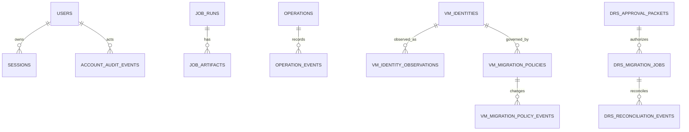

# 데이터베이스 기준선: 현재 Schema와 목표 Logical Ownership

- 상태: `APPROVED`
- 최종 검토일: `2026-07-20`
- 관련 migration·ADR: `backend/alembic/versions/`, [`ADR-002`](../decisions/adr-002-modular-monolith-domain-boundaries.md)

## 목적과 범위

- 현재 PostgreSQL schema와 table 역할을 코드 기준으로 보존한다.
- 현재 구현된 schema와 목표 domain ownership을 논리적으로 매핑한다. 이 문서는 기록된 `20260720_0026` 외의 추가 schema 변경이나 data migration을 승인하지 않는다.
- 적용된 Alembic migration은 절대 삭제·수정·재번호화하지 않는다.
- 상세 column/type는 `backend/app/db/models.py`와 Alembic revision이 우선한다.

## 데이터 소유권

| 현재 table | 현재 역할 | 목표 logical owner | 변경 권한·읽기 계약 |
|---|---|---|---|
| `users` | local account, role, enabled state | Access | Access command/query |
| `sessions` | server-side login session | Access | Access만 발급·revoke; auth dependency가 조회 |
| `account_audit_events` | account operation audit | Evidence/Audit, producer Access | append/query; actor와 redaction 보존 |
| `create_vm_profiles` | provisioning profile | Workloads | Workloads profile command/query |
| `vm_create_requests` | Create VM request/result record | Operations | Create operation projection/linkage |
| `vm_instances` | Gjallar-created VM linkage | Workloads | Workload metadata; actual state로 사용 금지 |
| `job_runs` | latest job state projection | Operations | compatibility projection; audit source로 사용 금지 |
| `job_artifacts` | job artifact metadata/content | Evidence/Audit | 현재 upsert 의미를 append-only evidence와 분리 필요 |
| `operations` | 공통 operation current projection | Operations | target/action/mode/status/idempotency/digest/trusted actor/version의 canonical projection |
| `operation_events` | operation 상태 전이·evidence event | Evidence/Audit, producer Operations | operation별 monotonic sequence와 SHA-256 checksum chain; application update/delete 없음 |
| `vm_identities` | DRS-oriented stable VM identity | Workloads | generic workload identity 후보 |
| `vm_identity_observations` | observed fingerprint/history | Workloads | source/freshness를 갖는 observation 후보 |
| `vm_migration_policies` | VM migration policy current state | Policy/Approval | versioned policy query/command |
| `vm_migration_policy_events` | migration policy change history | Evidence/Audit | append-only producer event |
| `operation_locks` | DRS target operation lock | Operations | generic target lock/lease 후보 |
| `drs_approval_packets` | exact recommendation approval packet | Policy/Approval | generic plan approval 후보 |
| `drs_migration_jobs` | migration state와 task correlation | Operations | common operation/attempt 후보 |
| `drs_reconciliation_events` | ambiguous migration reconciliation history | Evidence/Audit 또는 Operations event | 의미·retention 확정 필요 |

## 현재 모델 관계

이 그림은 주요 업무 관계만 표현하며 exact foreign key는 ORM/Alembic이 우선한다.

## 현재 트랜잭션과 정합성

- session boundary: `backend/app/db/session.py`의 `session_scope()` 호출 단위.
- local strong consistency: DB constraint, unique identity, last-admin rule과 단일 session write.
- external eventual consistency: Proxmox mutation/task/post-check와 Gjallar DB 기록.
- current job/artifact helper는 여러 transaction을 만들 수 있어 하나의 operation transition 원자성을 보장하지 않는다.
- `SqlAlchemyOperationStore`는 `operations` projection create/transition과 대응 `operation_events` append를 한 짧은 transaction으로 기록한다. optimistic version·event sequence·scoped idempotency constraint가 충돌을 거부한다.
- jobs read exception이 empty collection으로 변환되는 경로가 있어 availability failure와 no-data를 구분하지 못할 수 있다.
- VM Start, Create VM, Guided `qm unlock`은 schema 밖의 local VMID target file lock을 공유한다. DRS DB lock과는 공통 target concurrency contract를 공유하지 않는다.
- DRS migration은 기존 `drs_migration_jobs.execution_evidence`에 dispatch `prepared`/`accepted` evidence를 저장한다. 이 단계에서 schema migration은 추가하지 않았다.

## 목표 변화 원칙

- logical ownership과 repository contract를 먼저 도입하고 table rename/move는 나중에 한다.
- VM Start는 기존 `job_runs`/`job_artifacts` compatibility와 공통 operation/event를 dual record한다. Guided `qm unlock`은 공통 저장 구조를 사용한다.
- migration `20260720_0026`은 기존 table을 수정하지 않고 `operations`, `operation_events`를 additive하게 추가한다.
- projection과 immutable evidence를 분리한다.
- external call 전체를 DB transaction 안에 두지 않는다.
- dispatch attempt와 task reference를 crash-recovery 가능한 순서로 저장한다.
- target-scoped lock/lease는 idempotency identity와 별개의 invariant로 설계한다.

## Operations Core Schema

- `operations` primary key는 `operation_id`다. `(operation_type, target_type, target_id, idempotency_key)`가 scoped unique identity다.
- `execution_mode`는 `managed_api`, `guided_manual`, `observe_only`만 허용하고 `status`는 승인된 공통 taxonomy만 허용한다.
- projection은 `intent_digest`, `plan_digest`, trusted actor, `details`, expiry, `version`, `last_event_checksum`, timestamp를 가진다.
- `operation_events`는 `operation_id` foreign key와 `(operation_id, sequence)` unique constraint를 가진다. 각 row는 from/to status, stage, trusted actor, redacted payload, previous/current checksum을 기록한다.
- event append와 projection update가 실패하면 transaction 전체를 rollback한다. Proxmox API 호출과 operator의 외부 command 실행은 이 transaction 밖이다.
- checksum chain은 application-level tamper evidence다. external WORM, key signing, compliance retention은 현재 범위가 아니다.

## Migration 규율

- Forward: 새 revision만 추가한다.
- 기존 데이터: backfill은 idempotent하고 unknown/ambiguous value를 임의 success로 변환하지 않는다.
- 호환 배포: expand → dual read/write 또는 backfill → consumer 전환 → 검증 → 별도 승인 후 contract 순서를 사용한다.
- 복구: destructive rollback보다 forward correction을 기본으로 하며 live mutation record를 지우지 않는다.
- 중단: full migration/schema test와 PostgreSQL behavior를 확인할 환경이 없으면 destructive migration을 수행하지 않는다.

## 주요 Query와 성능

- current job list/risk projection, workload identity lookup, policy/approval binding, operation lock lookup이 고신뢰 query다.
- 정량 traffic/retention 자료가 없으므로 index를 추측해 추가하지 않는다.
- 신규 operation/evidence schema 설계 시 target+state, idempotency identity, external task ref, time-ordered evidence query를 실제 query plan과 함께 검증한다.

## 보안과 보존

- password는 hash만 저장하고 raw password/token/session credential을 artifact에 저장하지 않는다.
- session과 account audit는 Access/Admin boundary를 통해서만 변경한다.
- Proxmox credential은 DB schema 범위가 아니라 secret reference/config로 유지한다.
- evidence retention 기간과 deletion policy는 미확정이다.
- backup/log에도 secret-bearing payload가 포함되지 않도록 application boundary에서 redact한다.

## 검증

- schema/migration: Alembic upgrade tests와 PostgreSQL runtime check.
- mapping: ORM repository, relationship, constraint tests.
- 정합성: duplicate idempotency, same target/different key concurrency, crash-window, approval digest, append-only evidence tests.
- failure: DB unavailable이 empty success가 아니라 degraded/error로 표현되는 contract test.
- 현재 상태: migration head에 `20260720_0026`을 포함한 Alembic schema test와 canonical Python 3.13 container backend 전체 `425 passed`를 확인했다. jobs DB failure semantics 변경은 공개 오류 계약 승인이 필요해 계속 보류한다.
