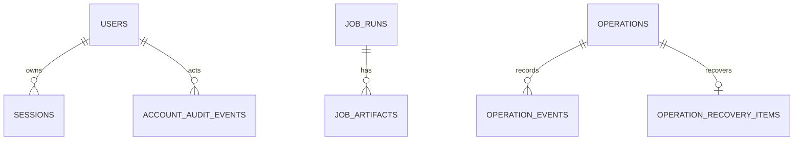

# 데이터베이스 기준선: 현재 Schema와 목표 Logical Ownership

- 상태: `APPROVED`
- 최종 검토일: `2026-08-24`
- 관련 migration·ADR: `backend/alembic/versions/`, [`ADR-002`](../decisions/adr-002-modular-monolith-domain-boundaries.md), [`ADR-004`](../decisions/adr-004-postgresql-durable-operation-recovery.md), [`ADR-007`](../decisions/adr-007-observe-first-operations-intelligence.md)

## 목적과 범위

- 현재 PostgreSQL schema와 table 역할을 코드 기준으로 보존한다.
- 현재 구현된 schema와 목표 domain ownership을 논리적으로 매핑한다. 현재 migration head는 `20260824_0029`다.
- 적용된 Alembic migration은 절대 삭제·수정·재번호화하지 않는다.
- 상세 column/type는 `backend/app/db/models.py`와 Alembic revision이 우선한다.

## 데이터 소유권

| 현재 table | 현재 역할 | 목표 logical owner | 변경 권한·읽기 계약 |
|---|---|---|---|
| `users` | local account, role, enabled state | Access | Access command/query |
| `sessions` | server-side login session | Access | Access만 발급·revoke; auth dependency가 조회 |
| `account_audit_events` | account operation audit | Evidence/Audit, producer Access | append/query; actor와 redaction 보존 |
| `create_vm_profiles` | provisioning profile | Workloads | Workloads profile command/query |
| `vm_create_requests` | Create VM request/result record | Operations | Create operation projection/linkage |
| `vm_instances` | Gjallar-created VM linkage | Workloads | Workload metadata; actual state로 사용 금지 |
| `job_runs` | latest job state projection | Operations | compatibility projection; audit source로 사용 금지 |
| `job_artifacts` | job artifact metadata/content | Evidence/Audit | 현재 upsert 의미를 append-only evidence와 분리 필요 |
| `operations` | 공통 operation current projection | Operations | target/action/mode/status/idempotency/digest/trusted actor/version의 canonical projection |
| `operation_events` | operation 상태 전이·evidence event | Evidence/Audit, producer Operations | operation별 monotonic sequence와 SHA-256 checksum chain; application update/delete 없음 |
| `operation_recovery_items` | operation별 due work, observer lease/fencing과 redacted recovery 상태 | Operations | VM Start/Shutdown foreground와 allowlisted runner가 write; token은 API/evidence에 노출하지 않음 |
| `operation_locks` | 공통 Proxmox locator durable lock | Operations | 네 지원 action의 cross-operation open-locator invariant 보존 |

## 현재 모델 관계

이 그림은 주요 업무 관계만 표현하며 exact foreign key는 ORM/Alembic이 우선한다.

## 현재 트랜잭션과 정합성

- session boundary: `backend/app/db/session.py`의 `session_scope()` 호출 단위.
- local strong consistency: DB constraint, unique identity, last-admin rule과 단일 session write.
- external eventual consistency: Proxmox mutation/task/post-check와 Gjallar DB 기록.
- current job/artifact helper는 일반적으로 여러 transaction을 만들 수 있어 하나의 operation transition 원자성을 보장하지 않는다.
- `SqlAlchemyOperationStore`는 `operations` projection create/transition과 대응 `operation_events` append를 한 짧은 transaction으로 기록한다. PostgreSQL FK를 만족하도록 parent projection을 먼저 flush하되 event까지 commit되기 전에는 transaction을 완료하지 않는다. optimistic version·event sequence·scoped idempotency constraint가 충돌을 거부한다.
- `SqlAlchemyRecoveryStore`는 lease generation/token/expiry를 row lock으로 검증하고 Operation event/projection, recovery status와 optional locator lock release를 같은 transaction에서 commit한다. external Proxmox GET은 transaction 밖이다.
- jobs read exception이 empty collection으로 변환되는 경로가 있어 availability failure와 no-data를 구분하지 못할 수 있다.
- VM Start, VM Shutdown, Create VM과 Guided `qm unlock`은 `operation_locks`의 open `proxmox_locator` partial unique index로 같은 cluster/VMID를 직렬화한다. local file lock은 compatibility guard다.

## 목표 변화 원칙

- logical ownership과 repository contract를 먼저 도입하고 table rename/move는 나중에 한다.
- VM Start/Shutdown은 기존 `job_runs`/`job_artifacts` compatibility와 공통 operation/event/recovery를 dual record한다. Create VM은 신규 plan부터 common operation/event와 기존 `vm_create_requests`/`vm_instances`/job/artifact를 dual record한다. Guided `qm unlock`은 공통 저장 구조를 사용한다. historical `job_type='drs_migration'` row와 artifact는 shared history로 읽을 수 있지만 신규 producer는 없다.
- migration `20260720_0026`은 기존 table을 수정하지 않고 `operations`, `operation_events`를 additive하게 추가한다. `20260721_0027`은 `operation_recovery_items`를 추가하고 `operation_locks.operation_type`을 VM Start/Create/Guided까지 확장하며 open locator cross-operation partial unique index를 추가한다. `20260721_0028`은 check constraint에 `vm_shutdown` type만 additive하게 허용한다. `20260824_0029`는 hard-zero guard 뒤 DRS 전용 7개 table과 `operation_locks`의 identity/route column·constraint를 제거한다.
- projection과 immutable evidence를 분리한다.
- external call 전체를 DB transaction 안에 두지 않는다.
- dispatch attempt와 task reference를 crash-recovery 가능한 순서로 저장한다.
- target-scoped lock/lease는 idempotency identity와 별개의 invariant로 설계한다.
- 제거된 DRS table과 identity observation을 generic Workloads, Policy, Operations 또는 Evidence owner로 승격하거나 데이터를 변환하지 않았다.

## Operations Core Schema

- `operations` primary key는 `operation_id`다. `(operation_type, target_type, target_id, idempotency_key)`가 scoped unique identity다.
- `execution_mode`는 `managed_api`, `guided_manual`, `observe_only`만 허용하고 `status`는 승인된 공통 taxonomy만 허용한다.
- projection은 `intent_digest`, `plan_digest`, trusted actor, `details`, expiry, `version`, `last_event_checksum`, timestamp를 가진다.
- `operation_events`는 `operation_id` foreign key와 `(operation_id, sequence)` unique constraint를 가진다. 각 row는 from/to status, stage, trusted actor, redacted payload, previous/current checksum을 기록한다.
- event append와 projection update가 실패하면 transaction 전체를 rollback한다. Proxmox API 호출과 operator의 외부 command 실행은 이 transaction 밖이다.
- checksum chain은 application-level tamper evidence다. external WORM, key signing, compliance retention은 현재 범위가 아니다.

## Durable Coordination Schema

- `operation_locks.scope_type`은 `proxmox_locator`만 허용한다. status가 `active`, `stale`, `reconciliation_required`인 row는 `(scope_type, scope_key)` partial unique index로 operation type을 가로질러 하나만 열릴 수 있다. DRS identity/route column과 FK는 없다.
- locator `scope_key`는 현재 `{cluster_id}|proxmox_locator|{vmid}`다. supported producer는 `vm_start`, `vm_shutdown`, `vm_create`, `guided_qm_vm_unlock`이다.
- `operation_recovery_items.operation_id`는 `operations`의 PK/FK이며 `vm_start_observation` 또는 `vm_shutdown_observation` recovery kind, `pending|leased|retry_wait|paused|completed`, due time, lease owner/token/generation/expiry, attempt/error, redacted details와 timestamp를 가진다.
- recovery lease token은 coordination write에만 사용하고 Operation detail에는 노출하지 않는다. lease expiry는 다른 observer claim만 허용하며 operation terminal 상태나 target lock release를 의미하지 않는다.
- due query는 `(status, available_at)`, lease query는 `(status, lease_expires_at)` index를 사용하고 PostgreSQL claim은 `FOR UPDATE SKIP LOCKED`, limit 1이다.

## Migration 규율

- Forward: 새 revision만 추가한다.
- 기존 데이터: backfill은 idempotent하고 unknown/ambiguous value를 임의 success로 변환하지 않는다.
- 호환 배포: expand → dual read/write 또는 backfill → consumer 전환 → 검증 → 별도 승인 후 contract 순서를 사용한다.
- 복구: destructive rollback보다 forward correction을 기본으로 하며 live mutation record를 지우지 않는다.
- 중단: full migration/schema test와 PostgreSQL behavior를 확인할 환경이 없으면 destructive migration을 수행하지 않는다.

## 주요 Query와 성능

- current job list/risk projection과 operation lock lookup이 고신뢰 query다.
- 정량 traffic/retention 자료가 없으므로 index를 추측해 추가하지 않는다.
- 신규 operation/evidence schema 설계 시 target+state, idempotency identity, external task ref, time-ordered evidence query를 실제 query plan과 함께 검증한다.

## 보안과 보존

- password는 hash만 저장하고 raw password/token/session credential을 artifact에 저장하지 않는다.
- session과 account audit는 Access/Admin boundary를 통해서만 변경한다.
- Proxmox credential은 DB schema 범위가 아니라 secret reference/config로 유지한다.
- evidence retention 기간과 deletion/archive policy는 미확정이다. shared Jobs/Artifacts의 historical DRS row는 migration `0029`가 변경하지 않는다.
- backup/log에도 secret-bearing payload가 포함되지 않도록 application boundary에서 redact한다.

## 검증

- schema/migration: Alembic upgrade tests와 PostgreSQL runtime check.
- mapping: ORM repository, relationship, constraint tests.
- 정합성: duplicate idempotency, same target/different key concurrency, crash-window, approval digest, append-only evidence tests.
- failure: DB unavailable이 empty success가 아니라 degraded/error로 표현되는 contract test.
- 현재 상태: migration head `20260824_0029`는 DRS 전용 table 또는 비-generic lock row가 하나라도 있으면 DDL 전에 중단하고 데이터를 자동 삭제·변환하지 않는다. PostgreSQL은 hard-zero 검사 전에 관련 table의 쓰기를 transaction 범위로 차단하고, SQLite는 `BEGIN IMMEDIATE`로 검사·DDL·version stamp를 한 rollback 가능한 transaction에 둔다. 빈/테스트 baseline→head, generic lock row, shared job/artifact, failure 원자성과 PostgreSQL constraint/index 보존을 검증했다. Docker entrypoint가 startup에 `alembic upgrade head`를 자동 실행하므로 production preflight와 별도 적용 승인 전에는 이 revision을 포함한 이미지를 배포하지 않는다. 2026-07-23 live recovery evidence는 역사적 기준선이며 이번 제거에서 live Proxmox나 production DB를 변경하지 않았다.
