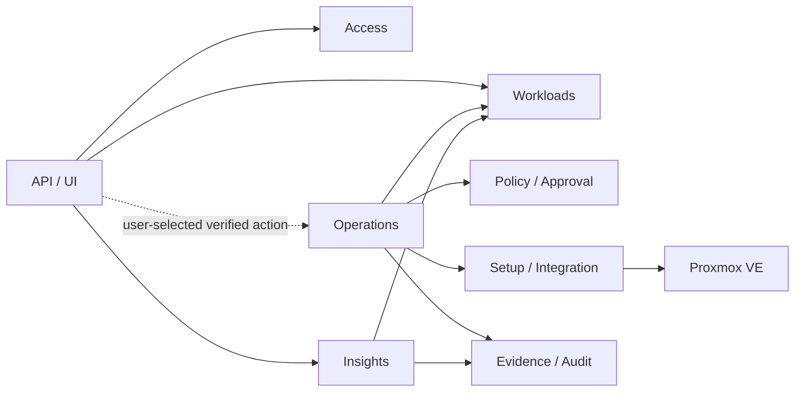

# 목표 도메인 지도

- 상태: `APPROVED`
- 최종 검토일: `2026-08-24`
- 관련 Architecture·ADR: [`현재 기준선`](../architecture/overview.md), [`ADR-002`](../decisions/adr-002-modular-monolith-domain-boundaries.md), [`ADR-003`](../decisions/adr-003-production-inventory-connection-truth.md), [`ADR-004`](../decisions/adr-004-postgresql-durable-operation-recovery.md), [`ADR-007`](../decisions/adr-007-observe-first-operations-intelligence.md)

이 문서는 observe-first 제품 방향의 목표 logical ownership과 현재 구현 범위를 함께 설명한다. Workloads와 Insights가 기본 read path를 제공하고 Operations는 명시적으로 지원되는 action만 조정한다. DRS package·API·전용 table은 신규 owner로 이전하지 않고 제거됐다. 이 문서는 이후 package/table 전환이나 data migration을 직접 승인하지 않는다.

## 도메인 목록

| 도메인 | 업무 책임 | 핵심 용어 | Gjallar 소유 데이터 | 공개 계약 | 금지 접근 |
|---|---|---|---|---|---|
| Workloads | provider-sourced workload/topology observation, stable identity, operator metadata와 profile | Workload, Resource Identity, Observation, Profile, Capability | source-scoped identity, fingerprint association, owner/environment/classification, create linkage, observation provenance/freshness | workload query, identity assertion, observation/capability query | Proxmox actual config·current node를 local truth나 배치 권위로 대체 |
| Operations | Create VM·VM Start·graceful VM Shutdown·Guided `qm unlock`의 intent, mode, attempt, lock, verification과 reconciliation | Operation, Plan, Attempt, Dispatch, Verification, Reconciliation | operation/attempt/step, idempotency, external task ref, target lock/lease, result projection | create/query/transition/reconcile supported action | arbitrary mutation, DRS/migration, policy 우회, insight-triggered dispatch |
| Policy / Approval | 지원 action별 실행 적격성, exact-plan approval와 acknowledgement | Policy, Evaluation, Approval, Plan Digest | action별 policy/version, evaluation, approval request/decision, actor/reason/expiry/digest | evaluate, request/decide approval, validate binding | DRS policy 일반화, operation result나 Proxmox actual state 소유 |
| Evidence / Audit | 판단·행동의 append-only provenance와 redacted artifact | Evidence Event, Artifact, Audit Event, Checksum | actor/action timeline, before/after/task refs, content-addressed artifact, redaction metadata | append/query evidence, verify checksum | mutable latest job projection을 audit 원본으로 간주 |
| Insights | 상태·변화·risk·readiness·capacity·placement/topology health 설명 | Finding, Context, Freshness, Provenance, Rule Version | derived finding, observation/evidence reference, rule/model version과 freshness metadata | query insight, explain evidence와 related operation | mutation dispatch, approval 자동 부여, generic TSDB·alert delivery 소유 |
| Access | local user/session/RBAC | User, Session, Role | users, sessions, account audit | authenticate, authorize, administer account | browser actor 신뢰, domain policy 소유 |
| Setup / Integration | Proxmox connector와 runtime mode·provider capability | Connection, Source, Credential Reference, Mode, Capability | connector config reference, unconfigured/live/degraded state, capability projection | connection health, observation/action port 제공 | credential 원문 노출, domain policy 판단, adapter 격리를 multi-provider 지원 약속으로 확대 |

## 관계

기본 사용자 경로는 Workloads observation과 Insights explanation이다. Operations는 사용자가 명시적으로 선택한 지원 action만 조정하고 Insights는 operation을 생성하거나 dispatch하지 않는다. Setup/Integration은 현재 Proxmox 전용이며 connector 격리는 유지보수와 이식성 경계이지 multi-provider 지원 약속이 아니다.

## 도메인별 불변 조건

### Workloads

- actual state는 Proxmox observation이며 local metadata와 구분한다.
- observation에는 `source`, `observed_at`, `freshness`, `mode`가 있다.
- current node와 power state는 관찰 대상이지 Gjallar가 유지하는 배치 권위가 아니다.
- target mutation은 stable identity와 fresh fingerprint/capability 확인을 요구한다.
- name, IP, tag, VMID 중 하나만으로 장기 identity를 확정하지 않는다.

### Operations

- operation intent와 idempotency identity는 dispatch 전에 저장한다.
- 지원 action은 Create VM, VM Start, graceful VM Shutdown과 allowlist 기반 Guided `qm unlock`으로 제한한다.
- migration, DRS와 automatic remediation은 operation action으로 제공하지 않는다.
- 하나의 operation은 target, action, plan digest, mode를 명시한다.
- 같은 target의 충돌 action은 idempotency key가 달라도 target-scoped lock/lease로 직렬화한다.
- target lock은 operation 충돌을 막는 durable state이고 recovery lease는 한 observer의 time-bounded 처리 권한이다. lease expiry만으로 target lock이나 operation 결과를 바꾸지 않는다.
- dispatch 결과 불명은 자동 재시도하지 않고 `needs_reconciliation`이다.
- action contract가 요구하는 terminal task 또는 authenticated operator attestation을 상관 연결하고 direct after-state가 확인되며 evidence가 저장된 뒤에만 `succeeded`다. attestation 자체는 성공 권위가 아니다.

### Policy / Approval

- policy evaluation은 version과 input evidence digest를 가진다.
- approval은 exact target/action/plan/evidence digest에 binding된다.
- expiry, actor, reason과 acknowledgement가 확인되지 않으면 dispatch할 수 없다.
- plan 또는 observation drift는 재평가·재승인을 요구한다.

### Evidence / Audit

- evidence event는 append-only이며 수정 가능한 projection과 분리한다.
- secret과 과도한 raw payload를 저장하지 않는다.
- actor, provenance, timestamp, checksum과 correlation identity를 보존한다.
- artifact 저장 실패를 성공으로 숨기지 않는다.

### Insights

- 모든 finding/recommendation은 근거, rule/model version, observed time, freshness를 가진다.
- unknown/unavailable을 low risk로 축소하지 않는다.
- recommendation은 승인이나 operation을 자동 생성·dispatch하지 않는다.
- finding은 관련 observation과 가능한 operation/evidence를 함께 설명한다.
- Insights에는 command port가 없으며 generic metric ingestion, TSDB retention과 alert delivery를 기본 책임으로 확장하지 않는다.

### Access

- actor identity는 server-side session에서 온다.
- role order는 별도 결정 전 `viewer < operator < admin`을 유지한다.
- account 변경은 audit event와 session invalidation rule을 따른다.

### Setup / Integration

- `unconfigured`/`live`/`degraded` connection truth를 명시한다.
- product runtime에서 missing credential이나 connection failure를 fake inventory로 대체하지 않는다.
- read port와 mutation port를 분리한다.
- connector는 acknowledgement, policy, approval을 판단하지 않는다.
- provider-specific transport와 identifier를 adapter에 두되 현재 지원 provider는 Proxmox 하나다.

## 도메인 간 상호작용

| 호출자 | 제공자 | 계약 | 정합성 | 실패 처리 |
|---|---|---|---|---|
| Operations | Access | trusted actor와 authorization | request-local strong | 거부 시 side effect 없음 |
| Operations | Workloads | target identity, observation, capability | fresh read + digest binding | stale/unavailable이면 blocked |
| Operations | Policy/Approval | policy evaluation과 exact-plan approval | local strong + expiry | reject/expire/drift 시 dispatch 없음 |
| Operations | Setup/Integration | managed API dispatch/task/post-check 또는 manual bundle input | external eventual | ambiguous이면 reconciliation |
| Operations | Evidence/Audit | intent, decision, attempt, task, verification append | local transaction 단위 | append 실패 시 success 공표 금지 |
| Insights | Workloads | actual observation projection | freshness-aware eventual | unknown/unavailable 명시 |
| Insights | Evidence/Audit | finding provenance | append/query | evidence 없는 finding은 노출하지 않거나 incomplete 표시 |

## 현재 table의 논리적 이동 후보

| 현재 table | 목표 logical owner | 주의사항 |
|---|---|---|
| `users`, `sessions` | Access | 기존 구조 유지 후보 |
| `account_audit_events` | Evidence/Audit, producer는 Access | ownership/API 경계만 먼저 정함 |
| `create_vm_profiles`, `vm_instances` | Workloads | actual state와 local metadata 분리 필요 |
| `job_runs` | Operations projection | immutable history가 아니므로 audit 원본으로 사용 금지 |
| `job_artifacts` | Evidence/Audit | upsert identity와 append-only artifact 구분 필요 |
| `operations` | Operations | 현재 projection; target/action/mode/status/idempotency/plan/actor/version 소유 |
| `operation_events` | Evidence/Audit, producer는 Operations | operation별 monotonic sequence와 checksum chain을 갖는 append-only event |
| `operation_locks`, `operation_recovery_items` | Operations | locator lock과 recovery는 네 지원 action이 계속 사용한다. DRS FK/scope는 hard-zero forward migration에서 제거됐다. |
| `vm_create_requests` | Operations compatibility | Create VM 신규 row는 공통 Operation과 dual record; 장기 migration은 별도 결정 |

## 경계가 불확실한 영역

- workload owner/environment/tag가 Gjallar metadata인지 Proxmox tag projection인지
- 공통 repository는 projection transition과 해당 event append를 하나의 transaction으로 기록한다. 기존 job/artifact와 향후 generic Policy approval의 transaction 범위는 미확정이다.
- separate approver role과 approval ownership
- recovery throughput이 늘 때 현재 Operations 내부 in-process adapter를 별도 worker process로 분리할 시점
- observation·derived insight cadence와 retention 및 외부 telemetry 연동 경계
- shared Jobs/Artifacts에 남은 historical operation evidence의 retention과 archive 정책

## 현재 구현 범위

- `backend/app/operations/core/`가 infrastructure-free 상태 전이·digest와 `OperationStore` 계약을 소유하고, SQLAlchemy adapter가 `operations` projection과 `operation_events` append를 한 transaction으로 기록한다.
- VM Start와 graceful VM Shutdown은 common Operation/recovery를 기존 `job_runs`/`job_artifacts`와 함께 기록한다. Shutdown은 hard stop/reboot fallback 없이 terminal task와 direct stopped state를 성공 권위로 사용한다.
- Create VM은 plan부터 common Operation을 만들고 approval·preview·dispatch·result·workload linkage를 event로 기록한다. 기존 `/vm-create/*`, `vm_create_requests`, `vm_instances`, job/artifact는 migration 없이 compatibility record로 병행한다.
- Guided `qm unlock`은 common Operation만 사용하며 `guided_manual` mode, expiry, trusted attestation, API verification과 reconciliation을 상태/event로 남긴다.
- `backend/app/operations/locks/`와 `recovery/`가 durable locator lock, due item, lease generation/token fencing과 allowlisted handler를 소유한다. VM Start/Shutdown은 dispatch 전 recovery item을 준비하고 opt-in FastAPI lifespan runner가 stored UPID와 actual state만 재관찰한다.
- Insights는 `backend/app/insights/`의 공통 finding/section 계약과 read application service로 구현됐다. `job_runs` risk와 current Workloads observation을 요청 시 조합하고 `insights/placement.py`가 neutral placement를 계산하며 persistent Insight table이나 command port는 없다. placement는 DRS identity/policy/lock persistence에 의존하지 않는다. source 장애와 미관찰 값은 `unknown`/`unavailable`, 200개 초과 finding은 truncation metadata로 드러낸다.
- DRS 전용 frontend route/client, backend API/runtime/config, ORM과 table contract는 제거됐다. `operation_locks`, `job_runs`, `job_artifacts`는 Operations/Evidence의 shared 구조로 보존하며 historical `drs_migration` job/artifact renderer는 신규 producer 없이 과거 evidence만 표시한다.
- `/insights`의 `drs_advisor` source와 `drs-rec-*` ID는 공개 compatibility 문자열로 유지하지만 DRS domain ownership, persistence 또는 실행 권한을 의미하지 않는다.
