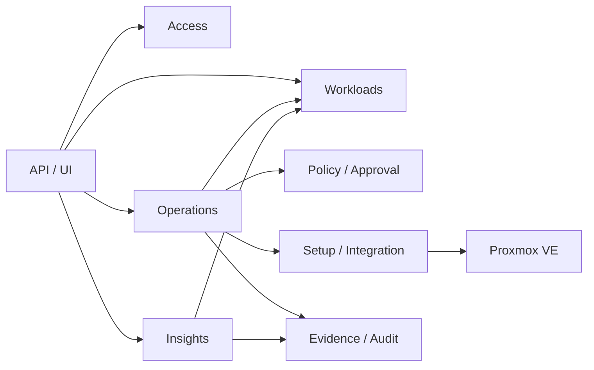

# 목표 도메인 지도

- 상태: `APPROVED`
- 최종 검토일: `2026-07-21`
- 관련 Architecture·ADR: [`현재 기준선`](../architecture/overview.md), [`ADR-001`](../decisions/adr-001-proxmox-gjallar-authority-boundary.md), [`ADR-002`](../decisions/adr-002-modular-monolith-domain-boundaries.md), [`ADR-003`](../decisions/adr-003-production-inventory-connection-truth.md)

이 문서는 승인된 logical ownership과 현재 구현 범위를 함께 설명한다. Operations core와 VM Start·Create VM·Guided `qm unlock` vertical slice가 이 경계를 적용했으며 나머지 package/table 전환이나 추가 data migration을 승인하는 문서는 아니다.

## 도메인 목록

| 도메인 | 업무 책임 | 핵심 용어 | Gjallar 소유 데이터 | 공개 계약 | 금지 접근 |
|---|---|---|---|---|---|
| Workloads | VM/template identity, operator metadata, profile, lifecycle context | Workload, Identity, Observation, Profile, Capability | stable identity, fingerprint association, owner/environment/classification, create linkage, latest observation projection | workload query, identity assertion, capability query | Proxmox actual config를 local truth로 대체 |
| Operations | change intent와 실행 상태기계, mode, attempt, lock, task correlation, verification, reconciliation | Operation, Plan, Attempt, Dispatch, Verification, Reconciliation | operation/attempt/step, idempotency, external task ref, target lock/lease, result projection | create/query/transition/reconcile operation | policy 우회, insight가 직접 dispatch |
| Policy / Approval | 실행 적격성, versioned policy, exact-plan approval와 acknowledgement | Policy, Evaluation, Approval, Plan Digest | policy/version, evaluation, approval request/decision, actor/reason/expiry/digest | evaluate, request/decide approval, validate binding | operation result나 Proxmox actual state 소유 |
| Evidence / Audit | 판단·행동의 append-only provenance와 redacted artifact | Evidence Event, Artifact, Audit Event, Checksum | actor/action timeline, before/after/task refs, content-addressed artifact, redaction metadata | append/query evidence, verify checksum | mutable latest job projection을 audit 원본으로 간주 |
| Insights | health, risk, readiness, capacity, placement recommendation | Finding, Recommendation, Freshness, Score | metric sample, derived finding, model/rule version, freshness | query insight, explain evidence | mutation dispatch, approval 자동 부여 |
| Access | local user/session/RBAC | User, Session, Role | users, sessions, account audit | authenticate, authorize, administer account | browser actor 신뢰, domain policy 소유 |
| Setup / Integration | Proxmox connector와 runtime mode·capability | Connection, Credential Reference, Mode, Capability | connector config reference, unconfigured/live/degraded state, capability projection | connection health, read/mutation port 제공 | credential 원문 노출, domain policy 판단 |

## 관계

의존 방향의 핵심은 Operations가 workflow를 조정하고 다른 domain은 자신의 판단·데이터 계약만 제공하는 것이다. Proxmox connector는 policy를 알지 못한다.

## 도메인별 불변 조건

### Workloads

- actual state는 Proxmox observation이며 local metadata와 구분한다.
- observation에는 `source`, `observed_at`, `freshness`, `mode`가 있다.
- target mutation은 stable identity와 fresh fingerprint/capability 확인을 요구한다.
- name, IP, tag, VMID 중 하나만으로 장기 identity를 확정하지 않는다.

### Operations

- operation intent와 idempotency identity는 dispatch 전에 저장한다.
- 하나의 operation은 target, action, plan digest, mode를 명시한다.
- 같은 target의 충돌 action은 idempotency key가 달라도 target-scoped lock/lease로 직렬화한다.
- dispatch 결과 불명은 자동 재시도하지 않고 `needs_reconciliation`이다.
- required task와 direct after-state가 확인되고 evidence가 저장된 뒤에만 `succeeded`다.

### Policy / Approval

- policy evaluation은 version과 input evidence digest를 가진다.
- approval은 exact target/action/plan/evidence digest에 binding된다.
- expiry, actor, reason과 acknowledgement가 확인되지 않으면 dispatch할 수 없다.
- plan 또는 observation drift는 재평가·재승인을 요구한다.

### Evidence / Audit

- evidence event는 append-only이며 수정 가능한 projection과 분리한다.
- secret과 과도한 raw payload를 저장하지 않는다.
- actor, provenance, timestamp, checksum과 correlation identity를 보존한다.
- artifact 저장 실패를 성공으로 숨기지 않는다.

### Insights

- 모든 finding/recommendation은 근거, rule/model version, observed time, freshness를 가진다.
- unknown/unavailable을 low risk로 축소하지 않는다.
- recommendation은 승인이나 operation을 자동 생성·dispatch하지 않는다.

### Access

- actor identity는 server-side session에서 온다.
- role order는 별도 결정 전 `viewer < operator < admin`을 유지한다.
- account 변경은 audit event와 session invalidation rule을 따른다.

### Setup / Integration

- `unconfigured`/`live`/`degraded` connection truth를 명시한다.
- product runtime에서 missing credential이나 connection failure를 fake inventory로 대체하지 않는다.
- read port와 mutation port를 분리한다.
- connector는 acknowledgement, policy, approval을 판단하지 않는다.

## 도메인 간 상호작용

| 호출자 | 제공자 | 계약 | 정합성 | 실패 처리 |
|---|---|---|---|---|
| Operations | Access | trusted actor와 authorization | request-local strong | 거부 시 side effect 없음 |
| Operations | Workloads | target identity, observation, capability | fresh read + digest binding | stale/unavailable이면 blocked |
| Operations | Policy/Approval | policy evaluation과 exact-plan approval | local strong + expiry | reject/expire/drift 시 dispatch 없음 |
| Operations | Setup/Integration | managed API dispatch/task/post-check 또는 manual bundle input | external eventual | ambiguous이면 reconciliation |
| Operations | Evidence/Audit | intent, decision, attempt, task, verification append | local transaction 단위 | append 실패 시 success 공표 금지 |
| Insights | Workloads | actual observation projection | freshness-aware eventual | unknown/unavailable 명시 |
| Insights | Evidence/Audit | finding provenance | append/query | evidence 없는 finding은 노출하지 않거나 incomplete 표시 |

## 현재 table의 논리적 이동 후보

| 현재 table | 목표 logical owner | 주의사항 |
|---|---|---|
| `users`, `sessions` | Access | 기존 구조 유지 후보 |
| `account_audit_events` | Evidence/Audit, producer는 Access | ownership/API 경계만 먼저 정함 |
| `create_vm_profiles`, `vm_instances` | Workloads | actual state와 local metadata 분리 필요 |
| `vm_identities`, `vm_identity_observations` | Workloads | DRS 전용 naming 제거는 migration 승인 후 |
| `job_runs` | Operations projection | immutable history가 아니므로 audit 원본으로 사용 금지 |
| `job_artifacts` | Evidence/Audit | upsert identity와 append-only artifact 구분 필요 |
| `operations` | Operations | 현재 projection; target/action/mode/status/idempotency/plan/actor/version 소유 |
| `operation_events` | Evidence/Audit, producer는 Operations | operation별 monotonic sequence와 checksum chain을 갖는 append-only event |
| `vm_create_requests`, `drs_migration_jobs`, `operation_locks` | Operations | 공통 operation으로의 이동은 forward migration 필요 |
| `vm_migration_policies`, `drs_approval_packets` | Policy/Approval | generic policy화는 실제 use case가 생길 때 수행 |
| policy/reconciliation event tables | Evidence/Audit 또는 Operations event | event 의미와 retention을 먼저 확정 |

## 경계가 불확실한 영역

- workload owner/environment/tag가 Gjallar metadata인지 Proxmox tag projection인지
- 공통 repository는 projection transition과 해당 event append를 하나의 transaction으로 기록한다. 기존 job/artifact와 향후 Policy approval까지 같은 transaction으로 묶을 범위는 미확정이다.
- separate approver role과 approval ownership
- durable runner/lease가 Operations 내부 adapter인지 별도 runtime component인지
- metric sample retention과 Insights read model storage
- DRS-specific identity/policy table을 generic domain으로 전환할 시점

## 현재 구현 범위

- `backend/app/operations/core/`가 infrastructure-free 상태 전이·digest와 `OperationStore` 계약을 소유하고, SQLAlchemy adapter가 `operations` projection과 `operation_events` append를 한 transaction으로 기록한다.
- VM Start는 common Operation을 기존 `job_runs`/`job_artifacts`와 함께 기록한다. 기존 API와 Jobs 화면의 compatibility 의미는 유지한다.
- Create VM은 plan부터 common Operation을 만들고 approval·preview·dispatch·result·workload linkage를 event로 기록한다. 기존 `/vm-create/*`, `vm_create_requests`, `vm_instances`, job/artifact는 migration 없이 compatibility record로 병행한다.
- Guided `qm unlock`은 common Operation만 사용하며 `guided_manual` mode, expiry, trusted attestation, API verification과 reconciliation을 상태/event로 남긴다.
- DRS는 아직 common Operation repository로 전환되지 않았다. DRS의 DB lock도 shared file lock과 통합되지 않았다.
